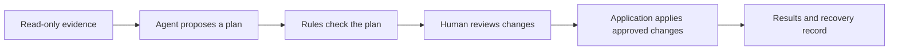

# Safepoint

Safepoint helps people review changes proposed by an AI agent before those changes reach real systems.

Instead of asking someone to approve a chat message, it presents a clear change set: what the agent inspected, what it wants to change, what it left out, what looks risky, and what happened after approval.

> **Status:** Stage 1A is implemented: the project now has a validated 27-line fictional evidence pack, agent replay, and separate policy replay. The next batch is the [Stage 1B static interface](docs/STAGE-1B-BRIEF.md).

## The idea



The agent can interpret incomplete or ambiguous information, but it cannot write to external systems. Ordinary application code checks non-negotiable rules and applies only approved, supported changes.

## The demonstration

The first version uses a fictional grocery promotion:

- 27 products must all be accounted for;
- the agent reviews prices, demand, stock, supplier information, funding, and channel readiness;
- a release coordinator approves, edits, holds, or rejects individual changes;
- Safepoint updates an isolated Google Sheet and a small storefront sandbox;
- conflicts, failures, verification, and recovery remain visible.

The public demo uses synthetic data and accepts no arbitrary prompts or production credentials.

## Project principles

- The model proposes; deterministic code decides what is allowed to execute.
- Missing and excluded items are as visible as proposed changes.
- Approval never silently expands beyond what the reviewer saw.
- Successful writes are verified.
- Recovery is described honestly; it may require a compensating action or human intervention.
- Technical state is translated into plain operational consequences.

## Running locally

Requires [Node.js](https://nodejs.org) 24 LTS (see `.nvmrc`) and pnpm 10.34.5. The exact pnpm version is recorded in `packageManager`; use Corepack or another version manager that honours that field.

```bash
corepack enable
pnpm install --frozen-lockfile
pnpm dev
```

The application is then served at http://localhost:3000. No environment variable or credential is needed at this stage.

Checks:

```bash
pnpm build          # production build
pnpm lint           # ESLint
pnpm typecheck      # generate Next.js route types, then run strict TypeScript
pnpm format:check   # Prettier
pnpm test           # Vitest contract and fixture tests
```

### Find a style's source in Chrome or Edge

Stop the existing dev server, then run:

```bash
pnpm dev:styles
```

Open http://localhost:3000 in Chrome or Edge. In DevTools **Settings → Preferences → Sources**, enable **CSS source maps**, then reload the page. Right-click an element and choose **Inspect**. In **Elements → Styles**, click the filename and line number beside a rule to open its original CSS in the Sources panel. For a particular property, use **Computed**, expand the property, and follow the winning declaration's source link.

This mode uses Webpack with development-only CSS source maps. The current Turbopack pipeline maps the combined Tailwind output to `globals.css`, losing the original imported file locations. `pnpm dev` remains available for normal Turbopack development.

- `app/review.css` defines the app shell and review component styles.
- `app/tokens.css` defines theme, colour, and typography tokens.
- `app/globals.css` defines base styles and custom utilities.

Generated Tailwind utilities do not map to the JSX `className` that uses them. Use Option/Alt-click below to open the component in your editor; CSS source links open in DevTools. Rules expanded with `@apply` may lead to the utility definition.

Browser documentation: [Chrome source map settings](https://developer.chrome.com/docs/devtools/settings/preferences) and [Edge source maps](https://learn.microsoft.com/en-us/microsoft-edge/devtools/javascript/source-maps).

#### Open the CSS file in VS Code

Source maps alone open the original CSS inside DevTools. To send those clicks to VS Code, Microsoft Edge provides an **Open source files in Visual Studio Code** integration:

1. In Edge DevTools, open **Settings → Experiments**, enable **Open source files in Visual Studio Code**, and restart DevTools.
2. On localhost, choose **Set root folder**, select this repository's `safepoint` directory, and allow access. You can also add the folder under **Settings → Workspace**.
3. Under **Settings → Workspace**, ensure **Open source files in Visual Studio Code** is enabled.
4. Inspect an element and click its CSS filename in **Styles**. A linked file opens in VS Code at the selector's line.

This is an Edge-specific integration; the source-map setting in Chrome does not itself launch VS Code. See [Microsoft's setup instructions](https://learn.microsoft.com/en-us/microsoft-edge/devtools/sources/opening-sources-in-vscode).

The CSS debugging configuration emits `file:///` URLs for existing source files so DevTools can match them directly to the local Workspace. After changing this configuration, close and reopen DevTools and reload the page. If a style still points to `webpack:///app/review.css`, the browser is using the earlier map. Generated sources without a file on disk retain their virtual URLs.

### Click-to-source in the browser

Hold <kbd>Option</kbd>/<kbd>Alt</kbd>, hover any element in the running app, and click to open the JSX behind it in your editor. This is [LocatorJS](https://www.locatorjs.com), wired up in two dev-only pieces:

- [`@locator/webpack-loader`](https://www.npmjs.com/package/@locator/webpack-loader) runs as a Turbopack rule in `next.config.ts` and stamps every JSX element with `data-locatorjs="<file>:<line>:<column>"`. React 19 removed the `_debugSource` fiber field LocatorJS used to read, so the location has to be baked into the markup instead. Because the attribute travels in the HTML, this covers server components, whose code never reaches the browser.
- [`@locator/runtime`](https://www.npmjs.com/package/@locator/runtime) draws the overlay, loaded by [`LocatorRuntime`](components/dev/locator-runtime.tsx) in the root layout.

**Do not install the browser extension** — disable it for `localhost` if you already have it. The published build (1.3.2, 2023) predates the path-based attribute format and only understands the older `data-locatorjs-id` scheme, so it reports *"No source info found for this element"*. It also injects its own copy of the overlay, and whichever runtime creates `#locatorjs-wrapper` first wins; the other silently gives up. `@locator/runtime` is that same overlay at a current version, so nothing is lost by leaving the extension off.

Both pieces are conditioned on `development` and excluded from production builds; the loader also skips `node_modules`.

### Switching typefaces in the browser

The families are still provisional, so components address the three semantic roles from [the experience specification](docs/EXPERIENCE-SPEC.md) — display, interface sans, and tabular utility — and never a family name. A `data-typeface` attribute decides which family fills each role, alongside the existing `data-theme`:

| Set | Display | Interface | Utility |
| --- | --- | --- | --- |
| `geist` (default) | Geist | Geist | Geist Mono |
| `glide` | Glide | Glide | Glide Mono |
| `inter` | Inter Tight | Inter | Inter, tabular figures |

The utility role is a second axis, because which mono suits a given sans is the open question and every pairing has to be reachable. `data-mono` overrides just that role — `sans` (the interface family with `tnum`), `geist`, `glide`, `jetbrains`, or `commit` — and no attribute leaves the set's own choice in place.

The Inter set deliberately has no separate mono. The spec asks for a "tabular **or** monospaced" utility role, and what the role carries here is mostly short English labels in tracked uppercase, where fixed advance widths only make word colour uneven, plus figures that need `tnum` rather than monospacing. `data-mono` puts a real mono back for comparison.

The **Aa** control in the bottom-right corner of the running app switches the set, the utility family, and the theme, and remembers the choice. `?font=glide&mono=commit` pins a combination for a screenshot or a shared link, and [`/workbench`](app/workbench/page.tsx) shows every set and every utility candidate side by side. Next's own dev indicator has no extension point for this, so the control is separate and sits opposite it.

Because both attributes resolve per subtree, any element can override the roles for its own contents — that is how the workbench compares them on one page.

Only the default set is preloaded; the alternates emit `@font-face` rules but download nothing until a role selects them. To change the shipped default, edit `DEFAULT_TYPEFACE_SET` in [`lib/typography.ts`](lib/typography.ts) and the `:root` role block in [`app/tokens.css`](app/tokens.css). Stylistic sets and mono weights belong in those same blocks, and the sans and the mono carry separate feature tokens: `ss01` names a different alternate in every family, so a setting that is right for the interface family is wrong for a mono paired across from it. Weights are per-family too — Glide Mono has only one, so it pins both weight tokens to 400.

Vendored under [SIL OFL 1.1](app/fonts/): [Glide](https://blode.co/glide) and [Commit Mono](https://commitmono.com/) (the [Fontsource](https://www.npmjs.com/package/@fontsource/commit-mono) build, which instances the variable source into real 400/500/600 cuts — the upstream release ships only 400 and 700). Inter, Inter Tight, and JetBrains Mono come from Google Fonts through `next/font`.

## Documentation

The detailed specification lives in [`docs/`](docs/README.md):

- [Product brief](docs/PRODUCT-BRIEF.md)
- [Experience specification](docs/EXPERIENCE-SPEC.md)
- [Promotion-release data dictionary](docs/PROMOTION-RELEASE-DATA-DICTIONARY.md)
- [Technical design](docs/TECHNICAL-DESIGN.md)
- [Delivery plan](docs/DELIVERY-PLAN.md)
- [Project review and decisions](docs/PROJECT-REVIEW.md)

## Next step

Build the [Stage 1B static review interface](docs/STAGE-1B-BRIEF.md) against the accepted replay loader. This stage adds the master-detail workspace and its visual and accessible interaction foundation without changing the scenario contract.

The later sequence remains local review, deterministic policy, a bounded live-agent check, persistence, durable fake execution, Google Sheets, and finally the storefront and public-release hardening. The ordered checklist is in [`TODO.md`](TODO.md).
