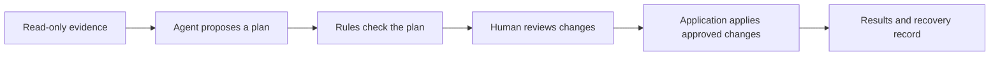

# Safepoint

Safepoint helps people review changes proposed by an AI agent before those changes reach real systems.

Instead of asking someone to approve a chat message, it presents a clear change set: what the agent inspected, what it wants to change, what it left out, what looks risky, and what happened after approval.

> **Status:** product and engineering design. Application development has started at [Stage 0](docs/STAGE-0-BRIEF.md): the project foundation only, with no domain code yet.

## The idea



The agent can interpret incomplete or ambiguous information, but it cannot write to external systems. Ordinary application code checks non-negotiable rules and applies only approved, supported changes.

## The demonstration

The first version uses a fictional grocery promotion:

- 27 products must all be accounted for;
- the agent reviews prices, demand, stock, supplier information, funding, and channel readiness;
- a release coordinator approves, edits, holds, or rejects individual changes;
- Safepoint updates an isolated Google Sheet and a small storefront sandbox;
- conflicts, failures, verification, and recovery remain visible.

The public demo uses synthetic data and accepts no arbitrary prompts or production credentials.

## Project principles

- The model proposes; deterministic code decides what is allowed to execute.
- Missing and excluded items are as visible as proposed changes.
- Approval never silently expands beyond what the reviewer saw.
- Successful writes are verified.
- Recovery is described honestly; it may require a compensating action or human intervention.
- Technical state is translated into plain operational consequences.

## Running locally

Requires [Node.js](https://nodejs.org) 24 LTS (see `.nvmrc`) and pnpm 10. pnpm reads the exact patch from `packageManager` in `package.json` and uses it automatically.

```bash
pnpm install
pnpm dev
```

The application is then served at http://localhost:3000. No environment variable or credential is needed at this stage.

Checks:

```bash
pnpm build          # production build
pnpm lint           # ESLint
pnpm typecheck      # strict TypeScript, no emit
pnpm format:check   # Prettier
pnpm test           # Vitest (no tests exist yet)
```

## Documentation

The detailed specification lives in [`docs/`](docs/README.md):

- [Product brief](docs/PRODUCT-BRIEF.md)
- [Experience specification](docs/EXPERIENCE-SPEC.md)
- [Technical design](docs/TECHNICAL-DESIGN.md)
- [Delivery plan](docs/DELIVERY-PLAN.md)
- [Project review and decisions](docs/PROJECT-REVIEW.md)

## Next step

Start with the deliberately small [Stage 0 foundation brief](docs/STAGE-0-BRIEF.md). It creates a clean, testable application shell without prematurely adding the database, model, workflows, or connectors.

Then build the smallest complete path in acceptance-gated slices: validated replay, local review, deterministic policy, a bounded live-agent check, persistence, durable fake execution, Google Sheets, and finally the storefront and public-release hardening. The ordered checklist is in [`TODO.md`](TODO.md).
