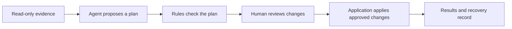

# Safepoint

Safepoint helps people review changes proposed by an AI agent before those changes reach real systems.

Instead of asking someone to approve a chat message, it presents a clear change set: what the agent inspected, what it wants to change, what it left out, what looks risky, and what happened after approval.

> **Status:** The app shell, process navigation and replay review of the first scenario (Alderton's 27-line promotion release) are implemented, with development-only model and policy workbenches. The main demonstration is moving to a simpler, sheet-driven process; see the [sheet process plan](docs/SHEET-PROCESS-PLAN.md), now in Phase 0.

## The idea


```mermaid
flowchart LR
    Evidence[Read-only evidence] --> Agent[Agent proposes a plan]
    Agent --> Checks[Rules check the plan]
    Checks --> Review[Human reviews changes]
    Review --> Execute[Application applies approved changes]
    Execute --> Record[Results and recovery record]
```

The agent can interpret incomplete or ambiguous information, but it cannot write to external systems. Ordinary application code checks non-negotiable rules and applies only approved, supported changes.

## The demonstration

The main demonstration, in progress, is one store's **Brunch weekend**: an avocado toast kit and a few single-item offers.

- The store's stock, sales, deliveries, parameters and plain-English rules live in a Google Sheet.
- Each rule becomes a checked formula that a person approves; code then evaluates every proposal the same way every time.
- The agent proposes orders and prices and explains its uncertainty; rules block or flag what isn't allowed.
- A reviewer approves, edits within a shown safe range, or rejects each change.
- A run can start at any time of the week: it shows what is still possible for the coming weekend and plans the one after.

The first scenario, Alderton's 27-line Fresh Food Weekend promotion release, remains in the app as the earlier scenario.

The public demo uses synthetic data and accepts no arbitrary prompts or production credentials.

## Project principles

- The model proposes; deterministic code decides what is allowed to execute.
- Missing and excluded items are as visible as proposed changes.
- Approval never silently expands beyond what the reviewer saw.
- Successful writes are verified.
- Recovery is described honestly; it may require a compensating action or human intervention.
- Technical state is translated into plain operational consequences.

## Running locally

Requires [Node.js](https://nodejs.org) 24 LTS (see `.nvmrc`) and pnpm 10.34.5. The exact pnpm version is recorded in `packageManager`; use Corepack or another version manager that honours that field.

```bash
corepack enable
pnpm install --frozen-lockfile
pnpm dev
```

The application is then served at http://localhost:3000. The app runs without credentials. The development-only model pages need `GOOGLE_GENERATIVE_AI_API_KEY`, and reading the Google Sheet needs the Composio variables listed in `.env.example`; put real values in `.env.local`.

Checks:

```bash
pnpm build          # production build
pnpm lint           # ESLint
pnpm typecheck      # generate Next.js route types, then run strict TypeScript
pnpm format:check   # Prettier
pnpm test           # Vitest contract and fixture tests
pnpm check:tokens   # every var(--…) is defined, used and at most two reads from a colour
pnpm check:colours  # custom-ramp contracts and generated output
pnpm check:unused   # unused files, exports and dependencies (Knip)
pnpm check:colour-system # colour-system browser checks
pnpm trace:token <role>  # where a role is declared and what it paints (a tool, not a check)
```

CI (`.github/workflows/checks.yml`) runs `lint`, `typecheck`, `format:check`, `test`, `check:tokens`, `check:colours`, `check:unused` and `build`, then the Playwright suite (which includes the colour-system checks), on each push to `main` and each pull request. The visual baseline (`pnpm check:visual`) stays local: it records text metrics, which follow the fonts installed where it runs.

In development, the design pane's Neutrals control (or `?neutral=`) switches
between the five generated neutral families on the real application.

`pnpm dev` uses webpack rather than Turbopack, for development-only CSS source maps: Turbopack maps the combined Tailwind output to `app/styles/index.css`, losing the file each rule is written in.

- `app/styles/` holds the shared tokens and foundations; `app/styles/index.css` imports everything in cascade order.
- A component's own styles sit in a `.css` beside its `.tsx`, such as `components/app-shell/sidebar/process-list.css`. `components/app-shell/` is grouped by feature: `sidebar/`, `process/`, `runs/`, `thread/`, `assistant/`, `inputs/`, `instructions/`, `system/`, with the shell itself at the root.

Generated Tailwind utilities do not map to the JSX `className` that uses them. Use Option/Alt-click below to open the component in your editor; CSS source links open in DevTools. Rules expanded with `@apply` may lead to the utility definition.

Browser documentation: [Chrome source map settings](https://developer.chrome.com/docs/devtools/settings/preferences) and [Edge source maps](https://learn.microsoft.com/en-us/microsoft-edge/devtools/javascript/source-maps).

#### Open the CSS file in VS Code

Source maps alone open the original CSS inside DevTools. To send those clicks to VS Code, Microsoft Edge provides an **Open source files in Visual Studio Code** integration:

1. In Edge DevTools, open **Settings → Experiments**, enable **Open source files in Visual Studio Code**, and restart DevTools.
2. On localhost, choose **Set root folder**, select this repository's `safepoint` directory, and allow access. You can also add the folder under **Settings → Workspace**.
3. Under **Settings → Workspace**, ensure **Open source files in Visual Studio Code** is enabled.
4. Inspect an element and click its CSS filename in **Styles**. A linked file opens in VS Code at the selector's line.

This is an Edge-specific integration; the source-map setting in Chrome does not itself launch VS Code. See [Microsoft's setup instructions](https://learn.microsoft.com/en-us/microsoft-edge/devtools/sources/opening-sources-in-vscode).

The CSS debugging configuration emits `file:///` URLs for existing source files so DevTools can match them directly to the local Workspace. After changing this configuration, close and reopen DevTools and reload the page. If a style still points to a `webpack:///` URL, the browser is using the earlier map. Generated sources without a file on disk retain their virtual URLs.

### Click-to-source in the browser

Hold <kbd>Option</kbd>/<kbd>Alt</kbd> under `pnpm dev` and point at any element: the style inspector names the component whose JSX wrote it, with a link to that line in your editor, and each component it sits in. It reads React's own development data, so there is no build step and no browser extension. See [`docs/STYLING-SYSTEM.md`](docs/STYLING-SYSTEM.md) → Finding where a style is written.

### Switching typefaces in the browser

The families are still provisional, so components address the three semantic roles from [the experience specification](docs/EXPERIENCE-SPEC.md) — display, interface sans, and tabular utility — and never a family name. A `data-typeface` attribute decides which family fills each role, alongside the existing `data-theme`. Three of the available sets ([`lib/typography.ts`](lib/typography.ts) lists them all):

| Set               | Display     | Interface | Utility                |
| ----------------- | ----------- | --------- | ---------------------- |
| `geist` (default) | Geist       | Geist     | Geist Mono             |
| `glide`           | Glide       | Glide     | Glide Mono             |
| `inter`           | Inter Tight | Inter     | Inter, tabular figures |

The utility role is a second axis, because which mono suits a given sans is the open question and every pairing has to be reachable. `data-mono` overrides just that role — for example `sans` (the interface family with `tnum`), `geist`, `glide`, `jetbrains` or `commit`; `MONO_CHOICES` lists them all — and no attribute leaves the set's own choice in place.

The Inter set deliberately has no separate mono. The spec asks for a "tabular **or** monospaced" utility role, and what the role carries here is mostly short English labels in tracked uppercase, where fixed advance widths only make word colour uneven, plus figures that need `tnum` rather than monospacing. `data-mono` puts a real mono back for comparison.

The **Aa** control in the bottom-right corner of the running app switches the set, the utility family, and the theme, and remembers the choice. `?font=glide&mono=commit` pins a combination for a screenshot or a shared link. Next's own dev indicator has no extension point for this, so the control is separate and sits opposite it.

Only the default set is preloaded; the alternates emit `@font-face` rules but download nothing until a role selects them. To change the shipped default, edit `DEFAULT_TYPEFACE_SET` in [`lib/typography.ts`](lib/typography.ts) and the `:root` role block in [`app/styles/type.css`](app/styles/type.css). Stylistic sets and mono weights belong in those same blocks, and the sans and the mono carry separate feature tokens: `ss01` names a different alternate in every family, so a setting that is right for the interface family is wrong for a mono paired across from it. Weights are per-family too — Glide Mono has only one, so it pins both weight tokens to 400.

Vendored under [SIL OFL 1.1](app/fonts/): [Glide](https://blode.co/glide) and [Commit Mono](https://commitmono.com/) (the [Fontsource](https://www.npmjs.com/package/@fontsource/commit-mono) build, which instances the variable source into real 400/500/600 cuts — the upstream release ships only 400 and 700). Inter, Inter Tight, and JetBrains Mono come from Google Fonts through `next/font`.

## Documentation

The detailed specification lives in [`docs/`](docs/README.md):

- [Product brief](docs/PRODUCT-BRIEF.md)
- [Sheet process plan](docs/SHEET-PROCESS-PLAN.md): the current track
- [Experience specification](docs/EXPERIENCE-SPEC.md)
- [Promotion-release data dictionary](docs/PROMOTION-RELEASE-DATA-DICTIONARY.md)
- [Technical design](docs/TECHNICAL-DESIGN.md)
- [Delivery plan](docs/DELIVERY-PLAN.md)
- [Project review and decisions](docs/PROJECT-REVIEW.md)
- [Prior art](docs/PRIOR-ART.md)
- [Styling system](docs/STYLING-SYSTEM.md)

## Next step

Finish Phase 0 of the [sheet process plan](docs/SHEET-PROCESS-PLAN.md): two short trials, one of the formula language and one of reading the sheet through Composio. Phase 1 then builds the data-defined rule engine against a captured snapshot of the sheet, and Phase 2 brings the review into the app shell.

Persistence, durable execution, the guarded Google Sheets write-back and public-release hardening from the [delivery plan](docs/DELIVERY-PLAN.md) still apply to this track. The ordered checklist is in [`TODO.md`](TODO.md).
