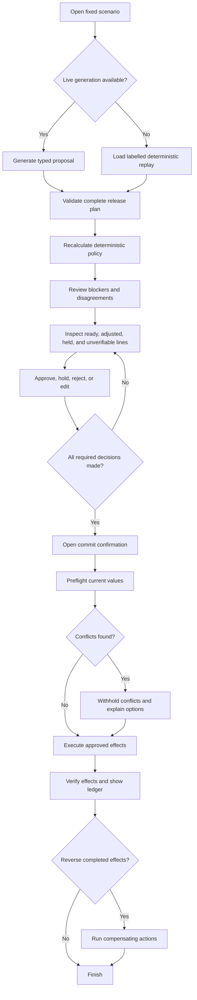
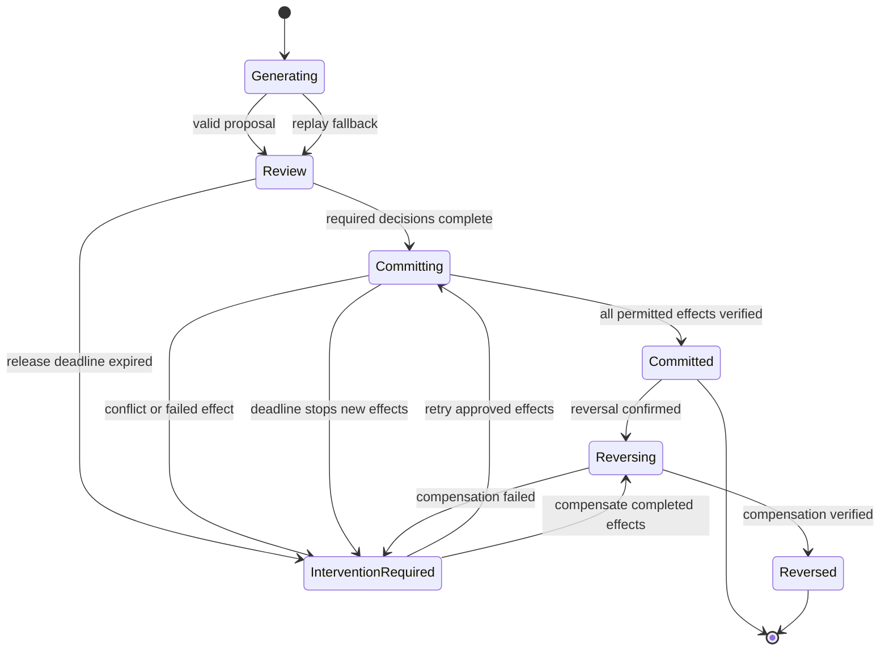

# Safepoint experience specification

Status: canonical interaction and visual specification

Audience: product designers and frontend engineers

## Experience goal

The review workspace has one job: help an operations specialist decide whether a proposed batch is safe to execute.

The interface should answer, in order:

1. What did the agent evaluate?
2. What does it propose changing?
3. What did it omit or fail to verify?
4. Which items require attention?
5. What happened after approval?

The primary object is the change set. Conversation and tool traces are supporting evidence.

## Scenario

At 08:45, Maya, the fictional release coordinator, opens the proposed release plan for Alderton's next grocery promotion. A fictional cutoff for final supplier top-up amendments is approaching, and the fictional label-production deadline is 06:00 the following day, approximately 21 hours and 15 minutes away. The main promotional orders were placed earlier in the planning cycle.

The 27 candidates arrive from a fictional approved promotion shortlist. This reflects the shape of Duvo's public [Promo Product Selection playbook](https://docs.duvo.ai/user-guide/playbooks/merchandising/promo-product-selection), which routes approved products to a pricing-agent queue. Safepoint is the downstream release checkpoint: it does not repeat product selection, and it keeps the originating cycle and approval visible as evidence.

The case contains 27 promotion lines. The stable replay presents 17 ready to release, six requiring an adjustment or individual attention, and four held, excluded, or unverifiable. No line is hidden from the evaluation summary. A live run can recommend a different safe treatment for genuinely ambiguous evidence, so the summary uses run-derived counts rather than hard-coded copy.

The agent has used four read-only capabilities to inspect the promotion brief, prices and costs, demand evidence, stock and open orders, final top-up options, supplier constraints, funding, channel readiness, and bounded buyer, forecast, and supplier notes. It has not changed an external system. Safepoint then independently evaluates deterministic release policy. The interface keeps source facts, agent judgement, and the application policy result distinct.

Maya reviews blockers and agent-policy disagreements first. She adjusts an allowed top-up quantity or promotional value, holds an unresolved line, checks all omitted or unverifiable lines, and approves the safe remainder. Before execution, Safepoint re-reads current values. A deliberately injected external edit causes one conflict. Safe effects continue according to policy, the conflict is withheld, and the ledger explains the partial result. The isolated Google Sheet and storefront sandbox change visibly; other destination effects are clearly identified as simulated or preview-only. Maya can then demonstrate compensation for eligible completed effects.

## Information architecture

The portfolio application has five user-facing destinations:

- **Review**: the primary master-detail workspace for a proposal batch.
- **Effects**: the execution and compensation ledger for the selected batch.
- **Evidence**: a bounded record of model inputs, tool results, and proposal rationale.
- **Storefront**: a read-only customer view of the promotion currently published in the session's sandbox.
- **About this demo**: mode, scenario limitations, data handling, and replay controls.

A protected component workbench is available outside the public navigation. It requires an explicit development or preview environment flag and contains no credentials or production data.

## Primary workspace

### Desktop composition

```text
┌──────────────────────────────────────────────────────────────────────────────┐
│ Safepoint       Promotion 24-09       LIVE SANDBOX       21h 15m remaining │
├──────────────────────────────────────────────────────────────────────────────┤
│ 27 evaluated   17 ready   6 need attention   4 held or unverified          │
├──────────────────────┬───────────────────────────────────────────────────────┤
│ Filter: All  Risk... │ Olive Oil 1 litre                         BLOCKED     │
│                      │ SKU 1189 · Cooking oils                              │
│ ● Olive oil          │                                                       │
│   Funding missing    │ Regular price       Promotional price                │
│ ○ Tomato soup        │ £4.80               [ £3.00           ]              │
│ ○ Granola            │                                                       │
│ ◌ Strawberries       │ Agent: release       Policy: blocked below margin    │
│   Held: late supply  │ Projected 9.2%       Policy minimum 15%              │
│ ...                  │ Affected systems                                      │
│                      │ Sheet ● → Storefront ● → SAP ◇ → Notification ◇       │
│ 27 of 27 shown       │ ● Live sandbox  ◇ Simulated                           │
│                      │ 7 readiness checks · 2 skipped            [Expand]     │
│                      │                                                       │
│                      │ [Hold] [Reject]              [Approve item (disabled)]│
├──────────────────────┴───────────────────────────────────────────────────────┤
│ 18 approved · 4 held · 5 pending              [Review omissions] [Commit]  │
└──────────────────────────────────────────────────────────────────────────────┘
```

The left pane is a candidate collection, not a collection of independent cards. The right pane is the detail for the selected candidate. On a blocked line, Approve item is visibly disabled and its accessible description identifies the blocking policy finding. The footer summarises review progress and keeps the next action visible without covering keyboard focus.

The header counts describe proposal outcomes: ready, needing attention, and held or unverified. The footer counts describe the reviewer's current decisions: approved, held, rejected, and pending. These are deliberately different summaries and must use their full labels rather than relying on numbers alone.

### Mobile composition

At narrow widths, the summary and candidate list form the first screen. Selecting a candidate navigates to a full-width detail view with a visible Back to candidates control. The browser Back action returns to the list and restores the selected item and scroll position.

The commit summary becomes an in-flow section. It must not be a sticky overlay that hides content or focus at 200% or 400% zoom.

## Visual direction

The visual metaphor is an operations ledger, not a chat application. Calm neutral surfaces support dense comparison. Colour communicates state, not decoration.

### Signature element: the effects rail

Every selected change includes a compact vertical or horizontal rail connecting its intended targets. During execution, each node changes from planned to applying, applied, failed, or compensated. Each node also shows its adapter mode: Live sandbox, Simulated, Preview only, or Unavailable. This makes propagation and partial outcomes spatially legible without pretending that an indicative integration executed.

The two genuine destinations are the isolated Google Sheet and the storefront sandbox. The Sheet may contain pricebook, promotion-release, top-up-order-draft, and label-queue tabs. The label-queue tab is a live staging record; it does not claim that physical labels were printed. A separate label-production service may appear as a simulated downstream effect so that the interface can explain when digital correction becomes physical store work. The storefront has its own API and persistence, plus a customer-facing view that changes only after verified execution. SAP and external messages may appear as simulated or preview-only destinations.

### Readiness and evidence presentation

Each line shows a compact readiness matrix covering forecast, inventory, supplier, financial, logistics, business-rule, and external-signal checks. This gate structure is consistent with Duvo's public [Auto-ordering skill](https://docs.duvo.ai/user-guide/skills/available-skills/auto-ordering). A check has one of five outcomes: Passed, Failed, Not checked, Evidence unavailable, or Not applicable. The detail view explains the source, observed time, relevant values, whether the gate is required or advisory for this line, and whether the result came from source data, agent judgement, or deterministic policy.

A required gate that failed, was not checked, or has unavailable evidence blocks approval. An advisory gap attracts attention and lowers confidence but does not automatically block release. Not applicable is derived from the process and line context with a visible reason; it is not a synonym for missing evidence. For example, supplier logistics may be required for a top-up line and not applicable when confirmed stock already covers the promotion.

When the model and policy disagree, the interface shows both without blending them:

```text
Agent recommendation   Release with a 480-unit top-up
Policy result          Blocked
Reason                 Projected margin 9.2%; policy minimum 15%
Evidence               Supplier funding record unavailable
Next action            Hold or obtain funding confirmation
```

Policy cannot silently rewrite the model's recorded recommendation. It controls whether the proposed effect is eligible for approval.

When judgement depends on narrative evidence, show the excerpt and the agent's interpretation separately. For example:

```text
Supplier note          “An extra pallet may be available if confirmed today.”
Agent interpretation   Allocation is possible but not confirmed.
Deterministic fact      Confirmed additional allocation: 0 units
Policy result           Hold top-up until allocation is confirmed
```

### Effect-specific detail

The workspace keeps one layout and lifecycle across services, but the detail presentation follows the effect kind:

| Effect kind | Primary review presentation |
| --- | --- |
| Set field | Expected and proposed values with field-level validation |
| Create resource | Proposed record and consequences of creation |
| Delete resource | Current snapshot, dependencies, retention, and deletion impact |
| Append entry | New entry and its position or destination |
| Transition state | Current state, target state, prerequisites, and consequences |
| Invoke command | Inputs, expected outcome, duration, and downstream effects |
| Send message | Recipients, subject, content preview, and recall limitation |
| Transfer file | File identity, destination, version, and resulting access |

Unregistered kinds or renderers are review-only and cannot be committed. Do not fall back to an executable raw JSON editor. Connector capabilities control language and actions: the interface says automatic compensation, manual follow-up, partial completion possible, or waiting for target system only when those descriptions are true.

Every effect also translates technical reversibility into plain operational consequences:

```text
Google Sheet       Can be restored automatically if the row has not changed again.
Storefront         Can be restored automatically before a later promotion replaces it.
Label queue        Can be removed until label production begins at 06:00.
Notification       Cannot be unsent; a correction message would be a new action.
```

### Typography

- **Headings and product moments**: Newsreader, used sparingly for the product thesis and batch title.
- **Interface and body**: Public Sans for durable readability at compact sizes.
- **Values, identifiers, and timestamps**: IBM Plex Mono with tabular numerals.
- Use system fallbacks and avoid downloading fonts before meaningful content can render.

### Colour tokens

Colours are semantic tokens rather than utility colours embedded in components. Final values must pass contrast checks in context.

| Token | Light | Dark | Purpose |
| --- | --- | --- | --- |
| `canvas` | `#F4F6F2` | `#0F1511` | Page background |
| `surface` | `#FFFFFF` | `#17201A` | Primary working surface |
| `text` | `#18211B` | `#EDF3EE` | Main text |
| `muted` | `#5A655D` | `#ABB8AE` | Secondary text |
| `line` | `#CCD3CE` | `#344239` | Dividers and control boundaries |
| `accent` | `#1C6A47` | `#65D39B` | Selection and positive action |
| `caution` | `#8A5200` | `#F2B45F` | Review-needed state |
| `danger` | `#A33A42` | `#FF9299` | Failure and destructive action |

Never communicate state by colour alone. Pair colour with text, icon shape, and programmatic state.

### Shape, elevation, and spacing

- Use square or modest 6px corners for working surfaces and controls.
- Reserve pill shapes for compact statuses, not containers or buttons by default.
- Use dividers and surface changes before shadows.
- Use one restrained shadow only for modal or genuinely floating content.
- Use an 8px spacing rhythm with 4px adjustments for dense value rows.
- Align numeric before-and-after values vertically and use tabular numerals.

### Motion

The one orchestrated motion is the effects rail progressing during execution. It must reflect real state rather than play on a timer. Under reduced-motion preference, replace travel or pulse animation with immediate state changes and a static progress indicator.

## Review flow



### Batch phase



The diagram shows batch phase only. Individual review decisions and effect execution states remain separate.

## Review actions

### Approve

Approval confirms that the proposed value may be executed if preflight checks still pass. It does not guarantee that the effect will succeed.

Approval has a bounded validity period defined by the scenario. Passing the fictional release deadline prevents commit and moves the batch to intervention required. Safepoint never interprets silence as approval, automatically releases a pending line, or relies on a paused external agent to escalate itself.

Bulk approval applies only to visible eligible items and must state the number affected before activation. High-risk items require individual review and are excluded from bulk approval.

### Hold

Holding removes an item from the current commit without rejecting the underlying proposal. The item remains visible and can be reconsidered before the batch is committed.

### Reject

Rejecting records that the proposal should not be executed. A reason is optional in the portfolio build but the action is added to the audit history.

### Edit

Only allow-listed proposed values are editable: promotional selling price, promotion dates, and recommended top-up quantity. Cost, stock, supplier constraints, evidence, identifiers, and current external values are read-only. Editing re-runs deterministic rules and clears any previous approval for that item.

### Review omissions

The omissions view lists every held, excluded, or unverifiable line, its reason, the evidence used, and whether the outcome came from the agent, deterministic policy, or unavailable evidence. It also reports any line the agent failed to account for before schema validation rejected the run. A blocked line cannot be approved until it becomes an eligible proposal and passes the required policy.

### Commit

Commit opens a modal confirmation that summarises approved, held, rejected, and unresolved items; target systems; irreversible effects; and the consequence of conflicts. Initial focus goes to the dialog heading for a long summary. Cancel and Commit approved changes are both visible. Escape cancels, and closing restores focus to the Commit trigger.

The action label remains Commit approved changes throughout the flow. Success text uses the same verb.

If the release deadline passes while committing, the current in-flight provider request is allowed to settle and be verified. The executor starts no new effect. Remaining planned effects are shown as Not attempted — deadline reached, the batch moves to intervention required, and no silence or partial approval is treated as permission.

### Reverse

Reverse opens a new confirmation showing which effects are eligible for automatic compensation. It does not promise to erase the original audit history or recall the simulated notification.

## Keyboard interaction

All functionality must work without custom shortcuts.

| Context | Required behaviour |
| --- | --- |
| Page | A skip link is the first focusable item and moves focus to the main heading. |
| Candidate collection | Tab enters and leaves the collection; Up and Down move the active candidate according to the selected React Aria collection pattern. |
| Candidate actions | Native buttons use Enter and Space. |
| Tabs, if used | Left and Right change tabs; Tab enters the active panel. |
| Dialog | Focus enters at a logical point, remains inside, Escape closes, and focus returns to the trigger. |
| Commit | The visible button is always available. Ctrl+Enter and Command+Enter may be supplemental when focus is outside an editable field. |
| Candidate movement | `J` and `K` are optional alternatives only while the candidate collection itself has focus. They never fire from an input, textarea, select, contenteditable region, or outside the collection. |
| Shortcut help | A visible Keyboard shortcuts button opens the reference. No shortcut is required to find it. |

Do not use positive `tabindex`. DOM order and visual order must agree. If a focused item disappears after filtering, move focus to the nearest remaining candidate or the filter summary. Focus indicators must remain fully visible against every surface, including high-contrast and forced-colours modes.

## Dynamic updates and announcements

Visible content is the primary feedback. Announcements supplement it without moving focus unnecessarily.

| Update | Accessible treatment |
| --- | --- |
| Proposal generation | Visible native progress where determinate; one stable `role="status"` for meaningful milestones and completion. |
| Filter result | A concise visible count using `role="status"`, debounced for typed filtering. |
| Item approved or held | Update the control state and batch summary; announce one concise polite result. |
| Commit progress | The visible effects ledger uses an accessibly named `role="log"` for appended, independently understandable events. Interactive controls remain outside it. |
| Commit completed | One visible polite status summarising applied, conflicted, and failed counts. |
| Form validation | Visible error summary receives focus; errors are associated with fields. Do not alert on every keystroke. |
| Connection loss during execution | A visible alert is permitted because the condition is time-sensitive. Routine failures use an error summary or status. |
| Conflict requiring a decision | Present a modal decision dialog and move focus into it rather than relying on an alert announcement. |

Live regions must be mounted before the update they announce. Do not clear and reinsert messages with fixed delays. Suppress stale asynchronous results and reset `aria-busy` on success and failure.

## Complete view-state inventory

The protected workbench and automated visual tests cover:

- initial scenario introduction;
- generating with progress;
- slow generation;
- live generation unavailable and replay offered;
- invalid model proposal;
- empty filtered list;
- full 27-candidate review;
- live run whose explanation differs from replay while policy outcomes remain consistent;
- agent recommendation and deterministic policy disagreement;
- seven readiness gates with passed, failed, not-checked, unavailable, and not-applicable outcomes;
- required, advisory, and not-applicable gate treatment;
- high-risk selected item;
- excluded selected item;
- edited item with re-evaluated policy;
- all required decisions complete;
- commit confirmation;
- preflight in progress;
- conflict injected;
- execution in progress;
- complete success;
- partial execution requiring intervention;
- compensation in progress;
- complete compensation;
- compensation failure;
- verified Google Sheet and storefront customer-view updates;
- live-sandbox, simulated, preview-only, and unavailable effect labels;
- expired sandbox session;
- expired release approval requiring a fresh proposal;
- deadline reached during commit with in-flight, verified, and not-attempted effects;
- live-generation kill switch active;
- executor circuit breaker active during a pending or partially applied batch;
- light, dark, increased-contrast, forced-colours, and reduced-motion modes.

## Error and empty-state copy

Messages state what happened and what the user can do next.

- **No candidates match these filters.** Clear a filter to return to the 27 evaluated candidates.
- **Live generation is unavailable.** Review the labelled replay or try live generation again.
- **This value changed after the proposal was created.** Compare the current value before approving a retry.
- **Three effects need attention.** Two can be retried and one must be resolved outside Safepoint.
- **This sandbox has expired.** Start a fresh isolated scenario.

Avoid vague copy such as Something went wrong. Preserve technical details in an expandable diagnostics area with a copyable reference identifier.

## Accessibility acceptance criteria

- Target WCAG 2.2 AA.
- Use semantic HTML and React Aria patterns before adding custom ARIA.
- Complete every primary and recovery flow with keyboard alone.
- Keep focus visible, logically ordered, and unobscured at all supported widths and zoom levels.
- Provide accessible names that contain visible control labels.
- Maintain at least 24 by 24 CSS pixel targets, with 44 by 44 as the preferred touch size.
- Do not prevent browser zoom.
- Test at 320 CSS pixels, 200% zoom, and 400% zoom without losing content or function.
- Test light, dark, increased-contrast, forced-colours, and reduced-motion modes.
- Run automated accessibility checks with zero serious or critical findings.
- Manually test VoiceOver with Safari and NVDA with Chrome; add NVDA with Firefox when it enters the support matrix.
- Test repeated and overlapping status updates, not just their final DOM text.

The [WAI-ARIA Authoring Practices Guide](https://www.w3.org/WAI/ARIA/apg/) informs widget behaviour. Passing automated checks alone is not acceptance.
