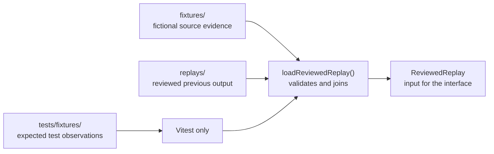
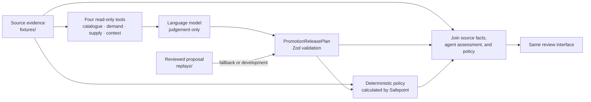

# Promotion-release data dictionary

Status: human-readable guide to the Stage 1A data contract

Audience: engineers, designers, and reviewers working with the Fresh Food Weekend scenario

## Purpose

This document explains the business meaning of the promotion-release schema. It is organised around the questions the data answers rather than the order of declarations in TypeScript.

The executable contract remains [`schemas.ts`](../lib/promotion-release/schemas.ts). Update this guide whenever a field is added, removed, or changes meaning.

## Data boundaries

Safepoint deliberately keeps three kinds of data in different locations:



In Stage 4, the live agent will inspect only the source evidence through four read-only tools and produce a new proposal through the same schema boundary. It will not read the curated replay or test oracle.

| Location | Meaning | May the application read it? |
| --- | --- | --- |
| `fixtures/` | Fictional facts representing what source systems currently report | Yes |
| `replays/` | A reviewed proposal and temporary policy result representing a previous completed run | Yes, through the loader |
| `tests/fixtures/` | Expected observations used to check the scenario and future agent behaviour | No; tests only |

The folders are separate even though all three contain synthetic data. A replay must never be supplied to a live agent as evidence, and an oracle must never be used to manufacture a runtime answer.

### Planned live and fallback paths

The interface is intentionally independent of where a valid proposal came from. A future live run and the reviewed fallback converge at the same validation boundary:



The model may interpret evidence and propose a plan, but it does not decide what policy permits and it cannot write to an external service. Safepoint validates the proposal, calculates policy, joins each result back to the source facts, and only then exposes the review model to the interface. During Stage 1, the policy result is also replayed; Stage 3 replaces that temporary input with the calculated policy path shown above.

## Shared identity and provenance

These fields appear in several files.

| Key | Meaning |
| --- | --- |
| `schemaVersion` | Version of the JSON structure. Change it when consumers must handle a different shape. |
| `scenarioId` | Stable identifier joining evidence and replay data for the same scenario. The current value is `aldertons-promotion-release-v1`. |
| `fixtureVersion` | Version of the fictional data values. It can change when prices or examples change without requiring a new schema shape. |
| `sku` | Stock keeping unit: the stable product identifier used to join records. Row numbers and display order are not identities. |
| `evidenceId` | Stable identifier cited by agent assessments and policy findings to show which source supports a claim. |
| `sourceLabel` | Human-readable description of the fictional source. |
| `observedAt` | When the source value was observed, stored as an ISO 8601 Coordinated Universal Time (UTC) timestamp. It supports freshness checks. |

`fixtureVersion` appears on source-evidence files and the policy replay. The proposal replay does not carry it because the loader binds and validates that proposal against the selected scenario evidence before the interface can use it.

## Promotion brief

File: `fixtures/promotion-release/aldertons-promotion-release-v1/promotion-brief.json`

The brief defines what the promotion is meant to achieve and the complete candidate set the agent must evaluate.

### Campaign

| Key | Meaning |
| --- | --- |
| `campaign.id` | Stable identifier for this particular campaign. |
| `campaign.name` | Display name: Alderton's Fresh Food Weekend. |
| `campaign.timezone` | Business timezone used when UTC timestamps are shown to the reviewer. |
| `campaign.reviewAt` | Fixed point at which Maya begins the review. |
| `campaign.topUpCutoffAt` | Last time a final supplier order amendment may be submitted in the scenario. |
| `campaign.labelDeadlineAt` | Time by which the label queue must be ready. It does not claim that physical labels have been printed. |
| `campaign.startsAt` / `endsAt` | Promotion period. The stored values are UTC even though the interface displays Europe/London time. |
| `campaign.objective` | Plain-language commercial aim that may help the agent choose among several safe plans. |

### Candidate lines

| Key | Meaning |
| --- | --- |
| `candidates` | The complete 27-line upstream-approved set. Every accepted proposal must contain each SKU exactly once. |
| `intendedPromotionalSellingPricePence` | Price requested by the promotion brief, stored as whole pence to avoid floating-point money errors. |
| `expectedUpliftPercent` | Expected percentage increase in demand caused by the promotion. |
| `status` | Whether the candidate remains `approved` or was later `withdrawn`. |
| `statusReason` | Explanation required for a withdrawn line; `null` for an approved line. |

## Shortlist provenance

File: `shortlist-provenance.json`

| Key | Meaning |
| --- | --- |
| `cycleId` | Identifier of the upstream promotion-selection cycle. |
| `upstreamScore` | Fictional 0–100 selection score from the earlier process. Safepoint does not recalculate product selection. |
| `selectionReason` | Why the product entered the shortlist. |
| `approvalReference` | Reference proving the candidate set was approved upstream. |
| `approvedAt` | Time of that upstream approval. |

## Catalogue and pricebook

File: `catalogue-pricebook.json`

| Key | Meaning |
| --- | --- |
| `productName` | Customer-readable product name. |
| `category` | Controlled product grouping used for display and scenario rules. |
| `unitDescription` | Pack or size description, such as `400g punnet`. |
| `regularSellingPricePence` | Normal customer selling price before the promotion. |
| `currentPromotionalSellingPricePence` | Promotional price currently held in the source, or `null` when none exists. `null` means absent; it is not zero. |
| `costPricePence` | Retailer's fictional unit cost before confirmed promotional funding. |
| `casePackUnits` | Number of retail units in one supplier case. This can constrain order quantities. |

## Demand evidence

File: `demand-evidence.json`

Demand records use `kind` to distinguish two valid shapes. An `available` record contains numbers; an `unavailable` record contains a reason and deliberately contains no substitute zero values.

| Key | Meaning |
| --- | --- |
| `kind` | Either `available` or `unavailable`. Code must narrow on this field before reading numeric evidence. |
| `recentWeeklySalesUnits` | Four weeks of recent unit sales, oldest to newest. |
| `baselineForecastUnits` | Expected demand without applying this promotion's uplift. |
| `promotionAdjustedForecastUnits` | Working forecast for the promotion period. `upliftAlreadyIncluded` says whether the brief's additional uplift is already embedded in this number. |
| `forecastConfidence` | `high`, `medium`, or `low`; a source assessment, not a Safepoint approval decision. |
| `upliftAlreadyIncluded` | Whether the supplied promotion forecast already includes the brief's uplift. If true, applying the uplift again would double-count demand. |
| `analystCommentary` | Optional bounded explanation from the fictional forecast source. It is evidence, not an instruction. |
| `reason` | Why an unavailable demand record cannot provide trustworthy numbers. |

## Supply position

File: `supply-position.json`

Supply also uses the `available` / `unavailable` `kind` distinction.

| Key | Meaning |
| --- | --- |
| `stockOnHandUnits` | Physical units reported as present at the distribution centre. |
| `reservedUnits` | Units already committed elsewhere and therefore unavailable to this promotion. |
| `confirmedInboundBeforeLaunchUnits` | Confirmed inbound supply expected before the promotion starts. |
| `earlierPromotionOrderUnits` | Units ordered earlier for this promotion. Keeping these separate prevents a last-minute top-up from ordering them again. |
| `openTopUpAmendmentUnits` | Units already included in an uncompleted final order amendment. |
| `safetyStockUnits` | Additional buffer retained above forecast demand. |
| `location` | Fictional distribution centre holding the position. |
| `reason` | Why an unavailable supply record contains no trustworthy quantities. |

Available supply before launch is calculated as:

```text
stock on hand
- reserved stock
+ confirmed inbound before launch
+ earlier promotion orders
+ open top-up amendments
```

Remaining shortfall is forecast demand plus safety stock minus available supply, with a minimum result of zero.

## Supplier terms and promotional funding

File: `supplier-terms.json`

Supplier funding is a fictional contribution from the supplier towards the retailer's promotional discount. For example, a supplier may contribute 20 pence per sold unit so that the customer can receive a lower price without the retailer absorbing the full reduction.

Funding is not customer payment, investment funding, or Safepoint financing.

| Key | Meaning |
| --- | --- |
| `supplierId` / `supplierName` | Stable identifier and display name of the fictional supplier. |
| `leadTimeHours` | Time the supplier needs between receiving an amendment and delivering it. |
| `minimumOrderQuantityUnits` | Smallest permitted top-up order. A positive recommendation below this value is invalid. |
| `orderMultipleUnits` | Quantity increment accepted by the supplier. With a multiple of 120, valid quantities include 120, 240, 360, and 480. |
| `confirmedAdditionalAllocationUnits` | Maximum extra stock the supplier has actually committed to make available. A narrative statement that stock “may” exist does not increase this value. |
| `topUpCutoffAt` | Supplier deadline for receiving a final top-up amendment. |
| `fundingStatus` | Whether the supplier's promotional contribution is usable in the margin calculation. See the values below. |
| `fundingPencePerUnit` | Proposed or confirmed supplier contribution for each unit, stored as whole pence. It counts towards margin only when `fundingStatus` is `confirmed`. |

### `fundingStatus` values

| Value | Meaning | Margin treatment |
| --- | --- | --- |
| `confirmed` | Documentary evidence confirms the supplier contribution. | Include `fundingPencePerUnit`. |
| `unverified` | Funding is expected or mentioned but has not been confirmed. | Treat as zero until confirmed. |
| `not_offered` | The supplier is not contributing to the promotion. | Treat as zero. |

The scenario's funded unit margin is:

```text
(promotional selling price - cost price + confirmed funding)
÷ promotional selling price
```

For the salmon line, the agent assumes expected funding will arrive. Deterministic policy does not: £5.00 selling price minus £4.54 cost produces 9.2% margin, below the 15% floor.

## Operational notes

File: `operational-notes.json`

| Key | Meaning |
| --- | --- |
| `noteType` | Origin category: `buyer`, `forecast`, `supplier`, or `campaign`. |
| `relatedSkus` | Products to which the note applies. |
| `text` | Bounded fictional narrative evidence that may require interpretation. |
| `trust` | Always `untrusted_evidence`. A note can inform reasoning but cannot override structured facts or instruct the system. |

These notes give the future agent a real judgement task. For example, “an extra pallet may be available” expresses possibility, while `confirmedAdditionalAllocationUnits: 0` remains the enforceable fact.

## Channel state

File: `channel-state.json`

| Key | Meaning |
| --- | --- |
| `channels` | Current staged state for the pricebook, storefront, and label queue. Each channel appears exactly once per SKU. |
| `channel` | `pricebook`, `storefront`, or `labels`. |
| `status` | `ready`, `mismatch`, or `not_scheduled`. |
| `promotionalSellingPricePence` | Promotional price currently staged in that channel, or `null`. |
| `startsAt` / `endsAt` | Dates currently staged in the channel, or `null`. These may differ from the approved brief and require correction. |

This `status` describes the state reported by a particular channel. It is unrelated to the line's final presentation `outcome`, a human review decision, or effect-execution state.

## Policy rules

File: `policy-rules.json`

| Key | Meaning |
| --- | --- |
| `policyVersion` | Identifies the deterministic rule set associated with an evaluation. |
| `minimumMarginPercent` | Lowest margin permitted for release. The scenario uses 15%. |
| `individualApprovalPriceChangePercent` | Price-change threshold above which bulk approval is not allowed. The scenario uses 25%. |
| `maximumEvidenceAgeHours` | Oldest evidence permitted before it is considered stale. |
| `requiredChannels` | Channels that must be accounted for before release. |

## Agent proposal replay

File: `replays/promotion-release/aldertons-promotion-release-v1/promotion-release-plan.json`

This is a reviewed example of what the future live agent must produce. It contains judgement and intended changes, not a copy of current source facts.

### Batch fields

| Key | Meaning |
| --- | --- |
| `instructionVersion` | Version of the fixed server-owned instruction used to request the proposal. |
| `summary` | Bounded agent-written explanation of the batch. Counts shown by the interface are still derived from line data. |
| `candidates` | Exactly one assessment for each of the 27 expected SKUs. |
| `evidenceRefs` | Complete set of source evidence identifiers used by the batch. |
| `generatedAt` | Time the proposal was generated. |

### Candidate assessment

| Key | Meaning |
| --- | --- |
| `agentRecommendation` | Agent opinion: `release`, `adjust`, `hold`, or `exclude`. Policy may disagree. |
| `proposed` | Proposed price, dates, quantity, and semantic actions; `null` for `hold` and `exclude`. |
| `gateAssessments` | Agent's evidence-backed assessment of the seven readiness areas. These are model evidence, not policy. |
| `rationale` | Why the agent prefers this treatment. |
| `uncertainties` | Assumptions or unresolved facts the agent has made explicit. |
| `evidenceRefs` | Source records supporting this candidate assessment. |

### Recommendation values

| Value | Meaning |
| --- | --- |
| `release` | The agent recommends the proposed release without changing the intended plan. It may still be blocked by policy. |
| `adjust` | The agent recommends a changed price, date, or top-up quantity. |
| `hold` | The agent does not propose executable changes until an issue is resolved. |
| `exclude` | The line should not participate in this release, for example because the brief withdrew it. |

### Proposed release

| Key | Meaning |
| --- | --- |
| `promotionalSellingPricePence` | Customer selling price proposed for the promotion. |
| `startsAt` / `endsAt` | Proposed promotion period. |
| `recommendedTopUpQuantityUnits` | Proposed final amendment to orders placed earlier. Zero means no additional top-up. |
| `semanticActions` | Business actions requested by the proposal. They contain no spreadsheet ranges, API endpoints, or credentials. |

| Semantic action | Intended consequence |
| --- | --- |
| `update_promotion_record` | Record the approved promotion price and dates. |
| `record_top_up_recommendation` | Store the reviewed top-up recommendation, including zero. |
| `schedule_storefront_promotion` | Schedule the promotion in the application-owned storefront sandbox. |
| `queue_labels` | Add a staging entry to the label queue; it does not claim labels were printed. |
| `release_top_up_amendment` | Submit the approved final supplier-order amendment through a future adapter. |
| `send_notification` | Create the simulated final notification after required reversible effects succeed. |

## Readiness gates

Every candidate contains each gate exactly once.

| Gate | Question it answers |
| --- | --- |
| `forecast` | Is demand evidence sufficient and interpreted without double-counting uplift? |
| `inventory` | Do stock, reservations, inbound supply, and existing orders support the plan? |
| `supplier` | Are supplier capacity, allocation, minimums, and multiples compatible with the proposal? |
| `financial` | Do price, cost, confirmed funding, and margin meet policy? |
| `logistics` | Can the required stock arrive before launch and before relevant cutoffs? |
| `business_rules` | Does the proposal follow the approved brief, dates, candidate status, and process rules? |
| `external_signals` | Do bounded contextual notes support or challenge the recommendation? |

### Agent gate results

| Value | Meaning |
| --- | --- |
| `passed` | The evidence supports the agent's proposed treatment. |
| `failed` | The agent identified evidence that does not satisfy the gate. |
| `not_checked` | The agent did not complete the check. This is not the same as passing. |
| `evidence_unavailable` | The required source could not provide trustworthy evidence. |
| `not_applicable` | The process deliberately does not require this gate for the line, with a reason. |

## Policy evaluation replay

File: `replays/promotion-release/aldertons-promotion-release-v1/policy-evaluation-replay.json`

This is temporary reviewed output for the static interface. It is separate from the agent plan because policy must be independently calculated. Stage 3 replaces this file as the runtime source with the real policy engine.

| Key | Meaning |
| --- | --- |
| `evaluationMode` | `replay`, making it explicit that this result was loaded rather than calculated live. |
| `policyVersion` | Rule-set version this expected result represents. |
| `evaluatedAt` | Time represented by the policy replay. |
| `candidates` | Exactly one policy evaluation for each of the 27 expected SKUs. |
| `eligibility` | Whether deterministic policy considers the line `eligible` or `blocked`. This does not overwrite the agent recommendation. |
| `gateObligations` | Whether each readiness gate is required, advisory, or deliberately not applicable for this line. |
| `findings` | Structured policy issues or review requirements. Empty means no policy finding for that line. |

### Gate obligations

Gate result and gate obligation answer different questions. Result says what the agent found; obligation says how important that check is to this particular line.

| Value | Meaning |
| --- | --- |
| `required` | Failure, omission, or unavailable evidence blocks the line. |
| `advisory` | The issue needs attention but does not automatically block release. |
| `not_applicable` | The process does not require the gate for this line and records why. |

### Policy findings

| Key | Meaning |
| --- | --- |
| `id` | Stable identifier for the individual finding. |
| `code` | Machine-readable reason such as `margin_below_floor`. |
| `severity` | `info`, `warning`, or `blocking`. |
| `approvalConsequence` | `none`, `individual_approval`, or `block`. This controls approval treatment in later stages. |
| `explanation` | Reviewer-readable statement of the issue. |
| `affectedFields` | Data fields involved in the finding. |
| `evidenceRefs` | Source evidence supporting the finding. |

The current replay uses these finding codes:

| Code | Meaning |
| --- | --- |
| `late_supply` | Supplier lead time cannot meet the promotion launch. |
| `unconfirmed_allocation` | The plan relies on extra stock the supplier has not committed. |
| `margin_below_floor` | Calculated margin is below the configured minimum. |
| `funding_unverified` | Expected supplier funding cannot yet be counted. |
| `promotion_withdrawn` | A later brief amendment removed the line. |
| `required_evidence_unavailable` | A mandatory source cannot provide a trustworthy value. |
| `uplift_already_included` | The supplied forecast already contains promotional uplift, so it must not be applied again. |
| `existing_supply_covers_demand` | Current and already ordered supply remove the need for another top-up. |
| `invalid_order_multiple_corrected` | A quantity was adjusted to satisfy supplier minimum and multiple rules. |
| `channel_dates_corrected` | Staged dates differed from the approved campaign dates and were corrected. |
| `alternative_safe_plan` | More than one policy-compliant price and quantity combination is available. |
| `large_price_change` | The discount exceeds the threshold for individual review. |

## Joined review data

`loadReviewedReplay()` validates all inputs and creates one `ReviewLine` per SKU. Each line keeps these concerns separate:

| Key | Meaning |
| --- | --- |
| `brief`, `shortlist`, `catalogue`, `demand`, `supply`, `supplier`, `channel`, `notes` | Application-owned source evidence. |
| `agentAssessment` | The replayed agent recommendation and rationale. |
| `policyEvaluation` | Separate replayed policy eligibility and findings. |
| `outcome` | Presentation grouping derived from the recommendation and policy result. It is not a review decision or execution state. |

### `ReviewedReplay` wrapper

This is the single validated object returned to interface code.

| Key | Meaning |
| --- | --- |
| `mode` | Always `replay` in Stage 1. Later live results must be labelled honestly rather than presented as replay data. |
| `fixtureVersion` | Version of the fictional evidence values used to assemble this review. |
| `scenario` | Validated `ScenarioEvidencePack`: all source-evidence collections grouped without changing their provenance. |
| `proposal` | Validated `PromotionReleasePlan`: the replayed agent judgement. |
| `policy` | Validated `PolicyEvaluationReplay`: the separate temporary policy result. |
| `lines` | The 27 joined `ReviewLine` records used by the master-detail interface. |
| `summary` | Counts derived from `lines`. These values are never copied from a fixture or trusted from model prose. |

### Derived summary

| Key | Meaning |
| --- | --- |
| `total` | Number of review lines. The current contract requires 27. |
| `ready` | Number of lines whose outcome is `ready`. |
| `needsAttention` | Number of lines whose outcome is `needs_attention`. |
| `held` | Number of lines whose outcome is `held`. |
| `excluded` | Number of lines whose outcome is `excluded`. |
| `unverifiable` | Number of lines whose outcome is `unverifiable`. |
| `potentiallyReleasable` | `ready + needsAttention`; lines that policy permits to proceed, subject to human review. |
| `nonReleasable` | `held + excluded + unverifiable`; lines that cannot enter the release in their current state. |

### Presentation outcomes

| Value | Meaning |
| --- | --- |
| `ready` | Eligible proposal with no attention-level treatment. |
| `needs_attention` | Eligible, but adjusted or requiring individual attention. |
| `held` | Blocked until a known issue is resolved. |
| `excluded` | Deliberately left out of the release while remaining visible. |
| `unverifiable` | Blocked because required evidence is unavailable. |

The derived `summary` counts these outcomes and reports `potentiallyReleasable` and `nonReleasable`. Review decisions and execution states are introduced in later stages and must remain separate.
