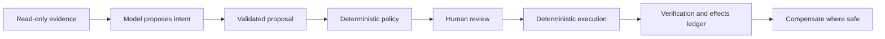

# Safepoint

Safepoint is an interface for inspecting, approving, executing, and reversing changes proposed by an AI agent before those changes affect real systems.

This directory is the canonical project specification. Earlier source material is retained locally for provenance but is intentionally excluded from the public repository.

## Status

Safepoint is in product and engineering definition. The repository does not yet contain application code.

The current specification is decision-complete for the first portfolio implementation. Assumptions that require real-user validation are labelled as such rather than presented as research findings.

## Thesis

A chat transcript explains what an AI agent said. It does not provide a reliable control surface for what the agent intends to change.

Safepoint turns model-generated intent into a typed proposal. A person reviews the proposed effects and omissions, deterministic policy identifies risk, and application-owned adapters execute and verify approved changes. The model never receives write authority.

Safepoint does not make a language model deterministic. Model output can still vary. It makes the downstream behaviour bounded and testable: output must match a known schema, unsupported output is rejected, policy is evaluated in code, and only approved typed effects reach deterministic adapters.

The model is used only where judgement is valuable. It interprets bounded ambiguous evidence and proposes among safe alternatives; deterministic code owns arithmetic, non-negotiable rules, gate obligations, and execution. If ordinary code could produce the whole answer from complete structured fields, the model would not earn a place in the design.

Duvo already provides connections, human requests, queues, run evidence, and a generic pre-flight approval pattern. Safepoint does not claim to replace or invent those capabilities. It is a specialised control plane that turns a process-specific proposal into a completely accounted-for, independently policy-checked, human-reviewed, verified, and recoverable set of external effects. See the official Duvo guidance on [safe pre-flight testing](https://docs.duvo.ai/user-guide/getting-started/test-safely) and [auditable runs](https://docs.duvo.ai/best-practices/auditable-runs).



## Read in this order

1. [`PRODUCT-BRIEF.md`](PRODUCT-BRIEF.md) explains the problem, users, product principles, portfolio boundary, and future direction.
2. [`EXPERIENCE-SPEC.md`](EXPERIENCE-SPEC.md) defines the scenario, interface, interaction model, visual system, responsive behaviour, and accessibility requirements.
3. [`TECHNICAL-DESIGN.md`](TECHNICAL-DESIGN.md) defines system boundaries, contracts, persistence, execution, security, observability, and failure behaviour.
4. [`DELIVERY-PLAN.md`](DELIVERY-PLAN.md) sequences implementation through acceptance-gated milestones.
5. [`PROJECT-REVIEW.md`](PROJECT-REVIEW.md) records corrections, alternatives, source coverage, assumptions, and rejected ideas.

The immediate implementation hand-off is [`STAGE-0-BRIEF.md`](STAGE-0-BRIEF.md). It is intentionally narrower than the architecture: Stage 0 creates a clean project foundation and no later-stage integrations.

## Two project tracks

### Portfolio track

The first deliverable is a public application and written case study built around one fixed synthetic grocery promotion-release scenario.

It demonstrates:

- 27 fully accounted-for promotion lines, with a stable replay and bounded live-agent variation;
- evidence-backed release recommendations covering demand, supply, commercial, and channel readiness;
- a structured review workspace rather than a chat-first interface;
- deterministic risk checks and granular approval;
- read-only model tools and validated output;
- preflight conflict detection and verified effects;
- a visible execution ledger and compensating actions;
- an isolated public sandbox and deterministic replay;
- complete light and dark themes;
- keyboard and screen-reader access.

The demo sends no real email, accepts no arbitrary prompt, and uses no production retail data.

### Future-product track

The longer-term direction includes rehearsal, alternative-plan comparison, richer connectors, organisation-level policy, collaborative approval, and enterprise identity. These ideas remain future work until the portfolio track proves the review and execution boundary.

An optional Duvo runtime adapter also belongs to this track. It could ingest run and case evidence, preserve upstream identifiers, present the specialised Safepoint review, and respond to the corresponding human request through Duvo's API. The portfolio application remains provider-independent and requires no Duvo credentials.

In that future integration, Safepoint would be the sole production-effect writer for a workflow it commits. The resumed Duvo run could record Safepoint's outcome, but it would not hold duplicate production credentials capable of applying the same action again.

## How the interface generalises

The core review experience can remain consistent when prompts, processes, and target systems vary. Generalisation requires three layers:

| Layer | Responsibility | Reuse model |
| --- | --- | --- |
| Review shell | Summary, candidate list, before-and-after values, risk, evidence, decisions, execution, and compensation | Shared across supported processes |
| Process definition | Proposal schema, allowed effects, editable fields, policies, labels, and field renderers | Defined once for each process type |
| Connector | Authentication, preflight, write, verification, errors, and compensation for an external service | Reused across processes that use the same supported operations |

A process does not need a new connector for every prompt. Google Sheets and SAP need different connectors because their authentication, data models, guarantees, and write operations differ. A process then maps its allowed effects to the capabilities already exposed by those connectors.

The shared abstraction is a typed effect, not an assumption that every operation is a key-value update. Field changes, record creation, deletion, appends, state transitions, commands, messages, and files share one review lifecycle while retaining different consequences and recovery rules.

Truly arbitrary processes cannot be executed safely through the common interface without onboarding. Safepoint must first know which effects are allowed, how they should be presented, what requires approval, and which connector operation can perform them. See [`TECHNICAL-DESIGN.md`](TECHNICAL-DESIGN.md#generalisation-model).

## Scenario in brief

Maya, a fictional category-operations manager and release coordinator at the fictional UK grocer Alderton's, reviews whether a 27-line promotion is safe to release. At 08:45, a fictional cutoff for final top-up amendments is approaching and a fictional label-production deadline at 06:00 the next day is approximately 21 hours and 15 minutes away. Main promotion orders were placed earlier in the planning cycle.

The agent derives a `PromotionReleasePlan` from a controlled evidence pack. Its four read-only capabilities expose:

- catalogue, current prices, costs, and case information;
- sales history, forecasts, and forecast confidence;
- stock, inbound quantities, open orders, and supply constraints;
- the promotion brief, supplier funding, channel requirements, deadlines, and policies.

The tools also expose bounded buyer, forecast, and supplier notes as untrusted evidence. This gives the agent a real interpretation task while deterministic policy continues to own reproducible calculations.

The 27 candidates represent a fictional approved upstream shortlist. This makes Safepoint the release checkpoint after product selection and pricing, consistent with the workflow shape in Duvo's public [Promo Product Selection playbook](https://docs.duvo.ai/user-guide/playbooks/merchandising/promo-product-selection). Readiness checks use the public [Auto-ordering](https://docs.duvo.ai/user-guide/skills/available-skills/auto-ordering) gate vocabulary, while the process definition independently declares whether each gate is required, advisory, or not applicable.

Every line must be represented as ready, adjusted, held, excluded, or unverifiable. The live model may vary in explanation and recommendations where evidence is ambiguous; source facts and deterministic calculations do not vary. Safepoint independently checks margin, stock cover, order constraints, dates, evidence completeness, and other release rules. It can therefore block a line even when the agent recommends release.

Maya approves the safe subset and can edit permitted price, date, and quantity fields. Deterministic adapters update an isolated Google Sheet and a real storefront sandbox, verify both results, and record every effect. SAP, label-service, and notification effects may be shown only when clearly labelled as simulated or preview-only.

Maya and Alderton's are design hypotheses, not validated research participants or organisations.

## Settled decisions

| Area | Decision |
| --- | --- |
| Positioning | Category-general product demonstrated through grocery promotion release |
| Model authority | Four read-only tools and a validated `PromotionReleasePlan` proposal batch |
| Write authority | Deterministic application services and connector adapters |
| UI structure | Master-detail review workspace with an effects rail |
| Styling | Tailwind CSS plus semantic design tokens |
| Interaction primitives | React Aria Components |
| Runtime and package manager | Node.js 24 LTS with pnpm 10 |
| Persistence | Neon Postgres with Drizzle ORM |
| Database connection | Chosen during persistence from the measured Vercel runtime; evaluate `node-postgres` with Fluid compute and Neon's HTTP path before using WebSockets |
| External demonstration | Isolated Google Sheets and a working storefront sandbox; other targets are explicitly simulated or preview-only |
| Recovery | Verified compensating actions, never an unqualified rollback promise |
| Execution runtime | Separate Vercel Workflows for proposal generation and approved-effect execution; never a browser- or request-owned batch |
| Workflow duplication | Each start creates a run; an application operation record and atomic first-step claim prevent duplicate business execution |
| Duvo relationship | Complementary specialised review and execution boundary; optional runtime adapter is future work |
| Public access | Fixed scenario, opaque session, strict limits, and replay fallback |
| Themes | Light and dark from the first milestone |
| Output | Working public application and written case study |
| Schedule | No calendar deadline; acceptance-gated milestones |

## Key terms

**Candidate:** one promotion line the agent was required to evaluate, whether ready, adjusted, held, excluded, or unverifiable.

**Proposal batch:** the validated, typed output containing the complete evaluation set. It has no external effect by itself.

**Review decision:** the user's current decision for an eligible proposed change: pending, approved, held, or rejected.

**Effect:** one planned change to one external target, such as a pricebook cell or storefront record.

**Preflight:** a fresh read immediately before an effect, used to detect whether the staged expectation is stale.

**Verification:** a read after an attempted write that confirms whether the intended value is present.

**Compensation:** a new action that attempts to restore the prior business state after an effect. It may fail or conflict and does not erase history.

**Replay:** a labelled, versioned proposal fixture that exercises the real review and execution path without a live model dependency.

**Run evidence:** the bounded tool and model record that explains how a proposal was produced.

**Effects ledger:** the append-only record of what the application attempted, verified, failed, or compensated.

## Repository layout

```text
safepoint/
├── docs/               Canonical product and engineering specification
├── .gitignore          Repository exclusions
├── README.md           Public project introduction
├── TODO.md             Ordered implementation checklist
└── skills-lock.json    Reproducible project-skill manifest
```

Local AI-agent configuration, installed skills, and the private source archive are excluded from version control. Operational files and the public entry point remain at the repository root.

## Documentation conventions

- British English and sentence-case headings.
- Plain technical language with acronyms defined on first use.
- Short sections and diagrams where relationships are easier to understand visually.
- Primary-source links beside consequential factual or technical claims.
- `Decided`, `Assumption`, and `Future` labels where status could otherwise be ambiguous.
- Local source material provides provenance but does not override this specification.

## Implementation guidance

The delivery sequence and acceptance criteria are in [`DELIVERY-PLAN.md`](DELIVERY-PLAN.md). During implementation, use the installed project skills for TypeScript, React, interface design, keyboard interaction, live regions, AI SDK integration, Drizzle, Neon, and Vercel Workflow at the phases identified there. Skills guide the work; current official product documentation and the installed package versions remain authoritative.

The canonical implementation order is replay-first: foundation, validated static replay, local review, deterministic domain core, a bounded live-generation feasibility pass, persistence and durable proposal generation, fake-adapter execution, Google Sheets, then storefront and release hardening. This order resolves the earlier conflict between the checklist and delivery plan.

Implement the Core proof before Public-release completion and do not begin Stretch work while the central review-to-ledger flow is incomplete. This is the scope stop rule; the project still has no artificial calendar deadline.

Do not add a model write tool, arbitrary public prompt, or unverified external write without first revising the architecture and threat model.
