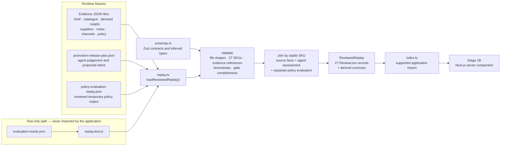

# Safepoint Stage 1A brief

Status: implemented

Audience: engineers maintaining the scenario contract and fixtures

## Outcome

Stage 1A establishes the data boundary for the first interface. It provides a complete fictional evidence pack, a validated agent replay, a separate replay of expected policy output, and a test-only evaluation oracle for all 27 Fresh Food Weekend lines.

The stage deliberately contains no interface, model call, policy engine, persistence, API route, or connector.

## Runtime boundary

Interface code begins with `loadReviewedReplay()` from `lib/promotion-release`. It returns source evidence, the agent proposal, replayed policy results, joined review lines, and derived counts only after Zod and cross-file validation succeeds.

Raw JSON is not trusted application state. The loader rejects incomplete candidate sets, duplicate candidates, unsupported values, unresolved evidence references, invalid dates, and contradictory proposal states.

### Current data flow

Stage 1B does not read JSON files directly. `loadReviewedReplay()` treats every fixture as untrusted input, validates it against the Zod contracts, checks relationships across files, and joins matching records by stable stock keeping unit (SKU). It returns one `ReviewedReplay` containing 27 review lines and derived summary counts. Application code imports this result through `index.ts`; the evaluation oracle is available only to tests.

| Artefact | Responsibility |
| --- | --- |
| Evidence fixtures | Application-owned fictional source facts |
| Promotion release plan | Agent judgement and proposed changes |
| Policy evaluation replay | Temporary reviewed policy output for the static interface |
| Zod schemas | Runtime shape and value validation |
| Replay loader | Cross-file validation, joining, and summary derivation |
| Runtime index | Supported import boundary for application code |
| Evaluation oracle | Test expectations only |

## Artefact separation

- The evidence pack is fictional source truth owned by the application.
- `PromotionReleasePlan` contains agent judgement and proposed intent. It does not repeat current source values as though they came from the model.
- `PolicyEvaluationReplay` is a reviewed static representation of expected policy output for the interface milestone.
- `evaluation-oracle.json` is test-only and cannot be imported through the runtime index.
- Stage 3 replaces the policy replay as the runtime source with calculated deterministic policy and retains the replay as a regression expectation.

## Accepted baseline

- Campaign: Alderton's Fresh Food Weekend.
- Scenario identifier: `aldertons-promotion-release-v1`.
- Fixture version: `1.0.0`.
- Exactly 27 sequential SKUs from `ALD-0001` to `ALD-0027`.
- Outcomes derived as 17 ready, six needing attention, two held, one excluded, and one unverifiable.
- Twenty-three lines are potentially releasable and four are not.
- Review at 08:45 Europe/London and label deadline at 06:00 the next day are exactly 21 hours and 15 minutes apart.

## Acceptance evidence

The Vitest suite validates the production loader, exact candidate set, seven gates per line, evidence references, outcome counts, deadline, seeded arithmetic, acceptable alternatives, and malformed-input rejection. The complete repository build, lint, type-check, formatting, test, and diff checks remain the final hand-off gate.

The next implementation brief is [`STAGE-1B-BRIEF.md`](STAGE-1B-BRIEF.md).
