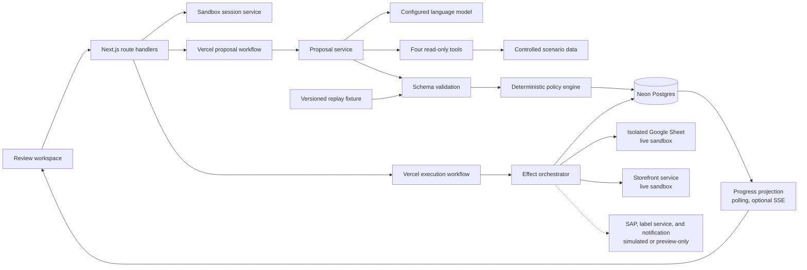
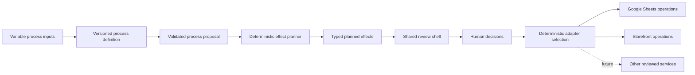
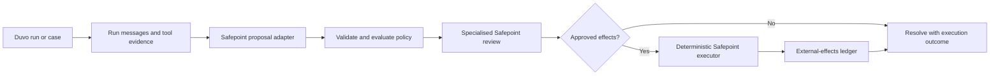

# Safepoint technical design

Status: canonical architecture proposal

Audience: software engineers and technical reviewers

## Architecture goals

Safepoint must make one boundary unmistakable: the language model may propose changes, but it cannot create external effects.

The system should also:

- remain understandable as a portfolio project;
- preserve a durable history of review and execution;
- tolerate stale data and partial dependency failure;
- offer a public sandbox without accepting arbitrary instructions;
- fall back to an honest, deterministic replay;
- avoid claims of atomicity or reversibility that the connectors cannot provide.

## System overview



The model and replay enter the application through the same validation boundary. Everything after validation is shared.

Proposal generation and approved-effect execution are separate durable workflows. The proposal workflow ends after it stores a validated proposal; it does not pause with write authority while a person reviews. A commit request first persists an immutable approved effect plan and operation record, then starts an execution workflow and returns to the browser. The workflow's first step atomically claims that operation in Neon and records its run identifier. A duplicate run for the same operation must exit without executing effects. External execution is therefore not owned by the lifetime of a browser or Next.js route handler.

## Generalisation model

The portfolio implements one fixed process, but the architecture separates the reusable review experience from process and connector concerns.



### Reusable review shell

The shell renders concepts shared by every supported process:

- complete candidate accounting;
- current and proposed values;
- risk findings and evidence;
- approve, hold, reject, and permitted edit actions;
- target effects and reversibility;
- execution, conflict, verification, and compensation state.

The shell does not render arbitrary model-authored UI. The portfolio imports a small, reviewed set of renderers for money, date, quantity, text diff, state transition, and message preview. A new effect or data type needs an explicit schema, renderer, policy treatment, and test before it can become executable.

### Process definition

A versioned process definition supplies the domain-specific contract. For the first process, use one directly imported typed module rather than string identifiers and registries:

```typescript
const promotionReleaseProcess = {
  id: 'promotion-release',
  version: 1,
  proposalSchema: promotionReleasePlanSchema,
  getCandidateSet: getPromotionCandidates,
  allowedEffectKinds: [
    'set_field',
    'append_entry',
    'invoke_command',
    'transition_state',
    'send_message',
  ],
  editableFields: [
    'promotionalSellingPricePence',
    'startsAt',
    'endsAt',
    'recommendedTopUpQuantityUnits',
  ],
  evaluatePolicy: evaluatePromotionReleasePolicy,
  planEffects: planPromotionReleaseEffects,
  display: promotionReleaseDisplay,
} as const;
```

The module defines what the model may propose, what the user may change, which deterministic rules apply, and how values are presented. It does not contain credentials or executable model-authored code. Direct imports keep dependencies visible and preserve compile-time checking; a runtime registry is not justified until a second process proves that it is needed.

The grocery promotion-release configuration is the first process definition. During the portfolio build it may remain a typed module rather than a general configuration language. A reusable format is justified only when onboarding a second process.

### Typed effect protocol

After proposal validation and policy evaluation, a deterministic planner maps allowed intent into a closed union of target effects. Shared metadata supports one review lifecycle, while each effect kind preserves its business meaning.

```typescript
type EffectKind =
  | 'set_field'
  | 'append_entry'
  | 'invoke_command'
  | 'transition_state'
  | 'send_message';

type CanonicalValue =
  | null
  | boolean
  | number
  | string
  | CanonicalValue[]
  | { [key: string]: CanonicalValue };

type EffectBase = {
  id: string;
  connectorId: string;
  operation: string;
  adapterMode: 'live_sandbox' | 'simulated' | 'preview_only' | 'unavailable';
  summary: string;
  resource: {
    kind: string;
    id: string;
    label: string;
  };
  evidenceRefs: string[];
  riskFindingIds: string[];
  dependencies: string[];
  reversibility: 'automatic' | 'conditional' | 'manual' | 'none';
};

type PlannedEffect =
  | (EffectBase & {
      kind: 'set_field';
      field: string;
      valueType: 'money_pence' | 'date_time' | 'quantity' | 'text' | 'boolean';
      expectedValue: CanonicalValue;
      proposedValue: CanonicalValue;
    })
  | (EffectBase & {
      kind: 'append_entry';
      proposedEntry: Record<string, unknown>;
    })
  | (EffectBase & {
      kind: 'transition_state';
      expectedState: string;
      proposedState: string;
      consequences: string[];
    })
  | (EffectBase & {
      kind: 'invoke_command';
      inputSummary: Record<string, unknown>;
      expectedOutcome: string;
    })
  | (EffectBase & {
      kind: 'send_message';
      recipients: string[];
      subject: string;
      contentPreview: string;
      recallSupport: 'none' | 'limited';
    });
```

The model does not choose raw connector methods, spreadsheet ranges, SAP endpoints, or credentials. The process definition and effect planner map validated business intent to an allow-listed operation.

Every executable value is normalised by the process-owned schema before storage or comparison. Object keys are sorted, invalid numbers are rejected, money remains integer pence, timestamps become ISO 8601 UTC, and connector-specific empty or formula values receive explicit representations. Preflight compares these canonical values rather than language-native object identity or display strings.

The portfolio implements live-sandbox `set_field`, `append_entry`, and `invoke_command` effects for Google Sheets and the storefront. It renders simulated `transition_state` and `send_message` effects only when they help explain SAP release and notification consequences. Creation, deletion, and file-transfer effects remain future product concepts; they do not appear in the portfolio union, renderer code, or adapter branches.

Every effect records `adapterMode: 'live_sandbox' | 'simulated' | 'preview_only' | 'unavailable'`. Execution state and adapter mode are separate facts. A preview-only effect cannot become `applied`; a simulated effect is labelled Applied in simulation rather than presented as an external change.

### Connector reuse

A connector is defined per external service and supported operation family, not per prompt. For example:

- one Google Sheets connector can support controlled table reads, cell or row updates, appends, verification, and restoration across several processes;
- one SAP integration can share authentication, transport, error mapping, and audit behaviour, while exposing separate reviewed modules for pricing conditions, material records, or purchase orders;
- each process supplies configuration that maps its effect kinds to those existing operations.

There is no credible universal write connector. Service APIs differ, and operations within one service can have different permissions, validation, atomicity, and reversal semantics.

### Integration, connection, action, and adapter

Keep four concepts separate:

| Concept | Responsibility |
| --- | --- |
| Integration definition | Describes a service and its available typed actions |
| Connection instance | Holds an authorised account, scopes, and credential reference |
| Connector action | Contains the executable implementation for one supported operation |
| Safepoint adapter | Maps an allow-listed effect to that action and normalises preflight, apply, verify, and compensate results |

An agent may select among read-only tools during proposal generation. That does not mean the agent implements the integration. Managed connectors may host their own actions; customer integrations may expose actions through a remote Model Context Protocol (MCP) server.

Duvo confirms that its standard and custom connections are MCP servers under the hood and that the connected user's permissions govern agent actions. See the official [Connections overview](https://docs.duvo.ai/user-guide/connections/connections-overview). Safepoint therefore treats a connection action as an external capability with declared guarantees, not as model-generated implementation.

Safepoint may reuse an external action only when deterministic application code can invoke it with a stable typed schema, bounded credentials, and auditable results. Routing an approved effect through a second autonomous executor agent would reintroduce non-determinism at the write boundary and is not an accepted implementation.

### Optional Duvo runtime adapter

Future product work may add an adapter between Duvo's runtime and Safepoint. Duvo's public API can start and monitor runs, read messages and tool results, receive run webhooks, manage queues and cases, and respond to human requests. See the [Developer Platform API](https://docs.duvo.ai/user-guide/running-assignments/api-overview) and [run monitoring guidance](https://docs.duvo.ai/user-guide/running-assignments/api-monitoring).

The safe integration direction is:



The adapter must preserve upstream `run_id`, `case_id`, human-request ID, revision, and message or tool-call identifiers. Duvo's narrative run record remains model evidence; it does not replace the typed `PromotionReleasePlan` or Safepoint's external-effects ledger. Rate limits and status mappings are adapter concerns: respect response headers and webhook contracts rather than hard-coding a value or assuming that Duvo and Safepoint lifecycle names are equivalent.

Safepoint is the sole holder of production write authority for a workflow it executes. A Duvo agent may have read and staging connections, but it must not retain an equivalent production write connection that could replay the approved action after its human request resolves. Safepoint responds with an outcome summary and identifiers; the resumed run records that result rather than executing it again. This is a credential boundary, not merely an AOP instruction.

This adapter is not part of the portfolio build. The public application remains provider-independent and does not require Duvo credentials. Exposing a broad Safepoint commit tool directly to the proposal-generating agent is rejected because it would weaken the review boundary.

### Supported variability

Prompts and input data may vary within a reviewed process module. A completely new process is review-only until it has a proposal schema, policy set, display configuration, and allow-listed connector mapping. This is deliberate onboarding, not a runtime attempt to infer safety from an arbitrary prompt.

## Selected stack

- Node.js 24 Long-Term Support (LTS), as listed in the official [Node.js release schedule](https://nodejs.org/en/about/previous-releases), and pnpm.
- Next.js App Router, React, and TypeScript.
- Tailwind CSS with semantic tokens for styling.
- React Aria Components for accessible interaction primitives. React Aria is unstyled and supports Tailwind according to its [official getting-started guidance](https://react-spectrum.adobe.com/react-aria/getting-started.html). Tailwind CSS supports `data-*` state variants directly, so an additional React-Aria-to-Tailwind helper is optional and should be installed only if the implemented components need it.
- Zod for proposal, route, configuration, and connector-boundary validation.
- Vercel AI SDK through [Vercel AI Gateway](https://vercel.com/docs/ai-gateway) for provider-neutral tool calling, structured output, spend controls, and model observability.
- Neon Postgres for the application ledger and sandbox metadata.
- Drizzle ORM for the Postgres schema, queries, and migrations.
- Google Sheets API for controlled promotion, top-up-recommendation, and label-queue effects.
- Vercel Workflow SDK for durable proposal generation, approved-effect execution, retries, recovery, and operational workflow inspection. Safepoint still owns effect idempotency, external-state reconciliation, and its audit ledger.
- Polling as the baseline progress transport; Server-sent events (SSE) may improve responsiveness after durable workflows are proven.
- Vitest for unit and integration tests, Playwright for browser tests, and axe-core for automated accessibility checks.

Exact dependency versions and model identifiers are selected and pinned when the application is scaffolded. Use current stable packages; do not copy release-candidate tags from an example without recording a deliberate decision. The AI SDK changes frequently, so its installed, version-matched documentation is authoritative. Current official guidance supports schema-defined tools and validated structured output through `generateText` or `streamText` ([tool calling](https://ai-sdk.dev/docs/ai-sdk-core/tools-and-tool-calling), [structured output](https://ai-sdk.dev/docs/reference/ai-sdk-core/output)).

Choose the Neon connection path during the persistence milestone, against the deployed runtime and installed stable versions. For a Node.js application on Vercel, the current default candidate is `node-postgres` with a pooled Neon connection and Vercel Fluid compute; attach the pool as required by current platform guidance. Neon's HTTP driver remains a valid alternative for one-shot queries and fixed non-interactive transactions. Use its WebSocket transport only when the implemented mutation genuinely requires an interactive transaction. Drizzle remains the schema and query layer whichever supported driver is selected. Use the pooled application URL for normal traffic and the direct URL for migrations. See Neon's [connection-method guidance](https://neon.com/docs/connect/choose-connection), [serverless-driver guidance](https://neon.com/docs/serverless/serverless-driver), and [Drizzle integration](https://orm.drizzle.team/docs/connect-neon).

Vercel Workflows supplies durable control flow and an operational event history; it does not become Safepoint's business audit record or make workflow starts or external writes exactly once. Each `start()` call creates a run, so a repeated or ambiguous start can create duplicate runs. Steps may also retry. Every proposal, commit, compensation, and cleanup workflow therefore uses a unique application operation record and atomic first-step claim. The claim prevents two runs from executing the same operation; it does not pretend that only one run was created. Workflow functions orchestrate deterministic control flow, while network calls and other side effects run in workflow steps. See the official [Vercel Workflows overview](https://vercel.com/workflows) and [idempotency guidance](https://github.com/vercel/workflow/blob/main/docs/content/docs/v4/foundations/idempotency.mdx).

Do not pin Neon or the application to a region from an outdated Workflow assumption. Before the Neon project is created, inspect the regions supported by the installed Workflow version and the planned Vercel runtime, choose an available Vercel and Neon pair, and run a latency check from the deployed application. Record that pair as an implementation decision. Region choice belongs to the persistence milestone because a Neon project's region cannot be casually changed later. Vercel's [function-region guidance](https://vercel.com/docs/functions/configuring-functions/region) is the starting point; installed package documentation and deployed behaviour remain authoritative.

## Runtime modes

### Live sandbox

Live mode invokes the configured model with the fixed scenario instruction and four read-only tools. The model can vary its tool order, rationale, emphasis, and recommendations where evidence permits more than one safe answer. It cannot vary the server-owned source facts, calculations enforced by policy, candidate set, or allowed action vocabulary. The result is accepted only after complete schema validation and deterministic policy evaluation.

Live mode is unavailable when its kill switch is active, its budget is exhausted, the provider times out, a proposal is invalid after the allowed attempt, or a required read dependency fails.

### Deterministic replay

Replay mode loads a versioned `ProposalBatch` fixture and the matching evidence fixture. It does not imitate streaming model text or claim to be live.

During the static-interface milestone, a separate `PolicyEvaluationReplay` supplies the reviewed expected policy output. This is an implementation bridge, not the policy engine and not model evidence. Stage 3 replaces it as the runtime source with calculated deterministic policy and retains it only as a regression expectation. The test-only evaluation oracle remains a fourth, separate artefact and is never imported by application code.

The fixture must:

- use the production proposal schema;
- contain the same 27 candidates as live mode;
- provide the reviewed baseline distribution of 17 ready lines, six requiring adjustment or attention, two held, one excluded, and one unverifiable;
- pass the same policy engine;
- support the complete review, conflict, execution, and compensation flow;
- carry a visible Replay label and fixture version.

Replay is the default fallback and the stable path for portfolio review, automated tests, and dependency outages.

## Agent boundary

### Scenario evidence pack

The agent derives its plan from a versioned fictional dataset. The data must be coherent enough that a reviewer can reproduce important calculations and understand why each line is safe, adjustable, blocked, or uncertain.

The source evidence under `fixtures/promotion-release/aldertons-promotion-release-v1/` is:

| Fixture | Contents |
| --- | --- |
| `promotion-brief.json` | Candidate SKUs, intended prices and dates, campaign, expected uplift, and release deadlines |
| `shortlist-provenance.json` | Promotion cycle, upstream selection scores and reasons, source reference, approval reference, and approved-at time |
| `catalogue-pricebook.json` | Product identity, regular and current promotional price, cost, and case pack |
| `demand-evidence.json` | Sales history, baseline forecast, promotion-adjusted forecast, confidence, and uplift provenance |
| `supply-position.json` | On-hand, reserved, confirmed inbound before launch, earlier promotion orders, open top-up amendments, safety stock, and location |
| `supplier-terms.json` | Lead time, minimum order quantity, order multiple, confirmed allocation, top-up cutoff, and funding status |
| `operational-notes.json` | Bounded promotion objectives, buyer notes, forecast commentary, and supplier qualifications that require interpretation |
| `channel-state.json` | Current staged price, dates, and readiness status for the pricebook, storefront, and label queue, with observed timestamps |
| `policy-rules.json` | Margin floor, individual-review price threshold, evidence freshness, and required channels |

Reviewed outputs live separately under `replays/promotion-release/aldertons-promotion-release-v1/`: `promotion-release-plan.json` contains the agent proposal, and `policy-evaluation-replay.json` contains the temporary static policy output used until Stage 3. The test-only oracle lives under `tests/fixtures/promotion-release/`. See the [promotion-release data dictionary](PROMOTION-RELEASE-DATA-DICTIONARY.md) for field-level definitions.

`evaluation-oracle.json` is never returned through an agent tool and is not a shortcut for runtime policy. Runtime rules independently calculate enforceable facts from the same source data. The oracle tests whether a model discovered expected conditions and whether policy produced the correct result.

Initial seeded exception designs include:

| Condition | Evidence encoded in fixtures | Expected treatment |
| --- | --- | --- |
| Promotion uplift counted twice | Forecast marks uplift as already included | Policy blocks a second uplift; evaluation records whether the agent noticed |
| Duplicate supply | An earlier order arrives before the promotion | Top-up recommendation must account for it |
| Invalid top-up quantity | Recommendation conflicts with the minimum or order multiple | Adjust to an allowed quantity or hold |
| Unfunded low margin | Supplier funding is unverified and projected margin is below the floor | Block until funding or price changes |
| Late supply | Supplier lead time exceeds the time available before launch | Hold, find an allowed alternative, or change dates |
| Channel mismatch | Storefront and label dates differ from the approved brief | Correct before release |
| Missing evidence | A required source returns unavailable for one line | Make the gap explicit and prevent unsupported release |
| Ambiguous allocation note | Narrative says extra stock “may” be available while confirmed allocation remains zero | Agent explains the uncertainty; policy blocks a top-up that relies on unconfirmed stock |
| Competing safe adjustments | Brief prioritises availability while more than one policy-compliant price and quantity combination exists | Agent proposes one evidence-backed option; reviewer may choose another allowed value |

Product names, quantities, prices, dates, and thresholds are finalised during data generation. Each seeded condition needs an arithmetic proof in test fixtures so that it does not depend on persuasive prose.

### Fixed input

The public user does not write a prompt. The server constructs a versioned instruction containing:

- the fixed Alderton's promotion-release task;
- the exact scenario identifier;
- definitions for the four tools;
- the required proposal schema;
- a requirement to account for every candidate;
- a prohibition on inventing missing values;
- a requirement to cite tool evidence identifiers;
- the allowed recommendation and semantic-action vocabulary;
- the requirement to distinguish failed, skipped, and unavailable checks.

User-controlled strings never become system instructions.

Duvo now publicly documents the seven-gate structure of its [Auto-ordering skill](https://docs.duvo.ai/user-guide/skills/available-skills/auto-ordering). That public description may ground the project's forecast, inventory, supplier, financial, logistics, business-rule, and external-signal vocabulary. The exact captured third-party skill file remains provenance only: do not copy or ship its text unless publication rights are confirmed. Write the project-owned promotion-release instruction from scratch, adapt it to these four tools, and record its version and checksum with every run. Where a result must be reproducible, follow Duvo's public division of responsibility: the agent orchestrates and deterministic code calculates. See [Let a Skill Do the Math](https://docs.duvo.ai/best-practices/let-a-skill-do-the-math).

### Read-only tools

The model receives exactly these capabilities:

```text
get_catalogue_and_prices(candidate_skus?)
get_demand_evidence(candidate_skus, window)
get_supply_position(candidate_skus)
get_promotion_context(category?)
```

The tools aggregate the fixture files without exposing new capabilities. Catalogue returns product, price, cost, case, and current channel information. Demand evidence returns sales, forecasts, confidence, uplift provenance, and bounded analyst commentary. Supply position returns stock, reservations, inbound orders, earlier bulk orders, top-up amendments, relevant supplier constraints, and bounded supplier notes. Promotion context returns the brief, funding, deadlines, channel requirements, policy inputs, and bounded buyer notes.

Each tool:

- reads only server-selected scenario data;
- validates inputs against a closed schema;
- rejects unknown identifiers and excessive lists;
- returns bounded, structured data with an evidence identifier and observed-at timestamp;
- treats narrative fields as untrusted evidence, never as instructions;
- records duration, result size, and success or failure;
- never accepts a spreadsheet ID, URL, credential, SQL fragment, or arbitrary filter from the model.

There are no model-accessible tools for writing prices, updating the storefront, creating labels, sending messages, committing, reversing, or changing approval state.

### Structured proposal

The process-specific generated contract is a `PromotionReleasePlan`, implemented as a proposal batch whose candidates contain the model's recommendation and evidence-backed gate assessments:

```typescript
type PromotionReleasePlan = {
  schemaVersion: 1;
  scenarioId: 'aldertons-promotion-release-v1';
  instructionVersion: string;
  summary: string;
  candidates: PromotionLineAssessment[]; // exactly 27 unique SKUs
  evidenceRefs: string[];
  generatedAt: string; // ISO 8601 UTC
};

type PromotionLineAssessment = {
  sku: string;
  agentRecommendation: 'release' | 'adjust' | 'hold' | 'exclude';
  proposed: ProposedRelease | null;
  gateAssessments: GateAssessment[];
  rationale: string;
  uncertainties: string[];
  evidenceRefs: string[];
};

type GateAssessment = {
  gate:
    | 'forecast'
    | 'inventory'
    | 'supplier'
    | 'financial'
      | 'logistics'
      | 'business_rules'
      | 'external_signals';
  result:
    | 'passed'
    | 'failed'
    | 'not_checked'
    | 'evidence_unavailable'
    | 'not_applicable';
  explanation: string;
  evidenceRefs: string[];
};

type ProposedRelease = {
  promotionalSellingPricePence: number;
  startsAt: string;
  endsAt: string;
  recommendedTopUpQuantityUnits: number;
  semanticActions: Array<
    | 'update_promotion_record'
    | 'record_top_up_recommendation'
    | 'schedule_storefront_promotion'
    | 'queue_labels'
    | 'release_top_up_amendment'
    | 'send_notification'
  >;
};

type GateObligation = 'required' | 'advisory' | 'not_applicable';
```

The proposal does not echo current prices, costs, stock, supply, or channel state. Those facts remain application-owned evidence and are joined with the model assessment only when the server constructs a `ReviewLine`. This prevents a plausible model-authored snapshot from being mistaken for source truth and avoids storing two competing copies of the same current value.

For the first interface milestone, each `ReviewLine` therefore keeps four named concerns separate: trusted source evidence, agent assessment, replayed policy evaluation, and derived presentation outcome. The outcome values `ready`, `needs_attention`, `held`, `excluded`, and `unverifiable` summarise the review view; they are not review-decision or execution lifecycle states.

`GateAssessment` is model evidence. During validation, the server derives `GateObligation` by evaluating a versioned process rule against the server-owned line context; the model cannot supply or override that classification. For example, supplier and logistics checks become required when a top-up is proposed and not applicable when confirmed stock already covers the line. A `not_applicable` result is accepted only when the derived obligation is also `not_applicable` and the rule supplies a reason. A required gate that is failed, not checked, or unavailable blocks its line. An advisory gate may lower confidence or require attention without automatically blocking. The validator rejects contradictory combinations rather than silently repairing them.

Money uses integer pence, not floating-point numbers. Timestamps are stored as ISO 8601 UTC and displayed in the scenario's Europe/London time zone.

Validation rejects the entire proposal when candidate identifiers are duplicated, missing, or outside the server-owned set; when a field or semantic action is unsupported; when evidence references do not exist; or when date, money, and quantity values are invalid. It does not silently drop malformed candidates.

The model proposes semantic actions only. It never chooses spreadsheet ranges, connector methods, storefront endpoints, credentials, or execution order. The deterministic effect planner resolves approved semantic actions to registered targets.

## Deterministic policy engine

The policy engine consumes a validated proposal and produces risk findings. Findings include a code, severity, human-readable explanation, affected fields, and approval consequence.

The first scenario implements:

- margin below the configured floor;
- promotion uplift already included in the supplied forecast;
- stock requirement that fails to account for reserved, inbound, or open-order quantities;
- top-up quantity below a minimum or outside the required order multiple;
- supplier lead time or confirmed allocation incompatible with the promotion dates;
- missing or unconfirmed supplier funding;
- inconsistent pricebook, storefront, or label dates;
- price change above the configured percentage threshold;
- missing or stale cost, demand, supply, supplier, or channel evidence;
- invalid promotion dates;
- promotional price not below regular selling price;
- duplicate or incomplete candidate accounting;
- a simulated non-recallable notification effect;
- current value different from the staged expected value.

Gate obligation is a deterministic function of the process definition and line context, not one static value for the entire process. The obligation evaluator uses source facts and proposed semantic actions. It does not interpret narrative evidence or accept a model-selected requirement.

Configuration is versioned with the scenario. The model's rationale and gate assessments are preserved as model evidence, but they cannot create, suppress, or change a deterministic finding or its severity. The review projection presents model recommendation and policy eligibility as separate fields so a disagreement is inspectable.

Policy evaluation runs after generation, after an editable field changes, and during commit preflight.

## State model

Do not place review and execution facts in one status column.

### Batch phase

`generating | review | committing | committed | reversing | reversed | intervention_required`

Only the server changes batch phase. Transition functions reject invalid source and destination pairs.

### Review decision

`pending | approved | held | rejected`

Each eligible proposed line has one current decision. Every transition also appends an immutable review event. Editing a permitted field resets the decision to `pending`.

### Effect execution

`planned | applying | applied | failed | compensating | compensated | conflicted | compensation_failed`

Each target effect owns its own state and attempt history. A batch summary is derived from its effects rather than used as a replacement for them.

### Edit history

An edit records actor, time, field, previous value, new value, and resulting policy version. `edited` is not a lifecycle state.

## Persistence model

Neon Postgres stores application state; Google Sheets remains an external target. Neon branches may isolate preview environments, but browser sessions are rows within the application schema rather than database branches. The minimum schema is:

| Table | Purpose | Important constraints |
| --- | --- | --- |
| `sandbox_sessions` | Opaque public session and expiry | Unique session digest; expiry index; no raw IP address |
| `agent_runs` | Provider/model, instruction and fixture versions, timing, outcome, token and cost data | Belongs to one session; bounded diagnostic payloads |
| `tool_evidence` | Read-tool inputs, outputs, freshness, and provenance | Immutable; evidence ID unique within run |
| `proposal_batches` | Batch identity, schema version, policy version, and phase | One active batch per fixed session scenario |
| `candidate_assessments` | All 27 line assessments, model recommendations, and gate results | Unique batch and SKU pair |
| `review_events` | Append-only approve, hold, reject, and edit history | Monotonic sequence within batch |
| `effects` | One intended effect per candidate and target, including adapter mode | Unique idempotency key; preview-only effects cannot be applied |
| `effect_attempts` | Preflight, write, verification, retry, and compensation attempts | Append-only with redacted error detail |
| `workflow_runs` | Proposal, commit, compensation, or cleanup operation claim, workflow correlation, and outcome | Unique operation key and provider run ID; at most one claimed commit or compensation run per batch operation |
| `audit_events` | Human-readable lifecycle history | Append-only; ordered by sequence, not timestamp alone |
| `rate_limit_buckets` | Hashed actor and window counters | Automatic expiry |

Use foreign keys, not-null constraints, check constraints, and unique indexes for invariants that belong in storage. Use Drizzle's Postgres schema definitions and generated migrations. Review generated SQL and use committed migrations outside local prototyping; do not use schema push as the deployment workflow.

A short database transaction may update a projection and append its audit event together. Never hold a database transaction open while calling a model, Google Sheets, or another network dependency.

## Application interfaces

The routes are internal application APIs, not a supported third-party API.

| Method and route | Responsibility |
| --- | --- |
| `POST /api/sessions` | Create an isolated scenario session and set the opaque cookie |
| `POST /api/proposals` | Start live generation or explicit replay for the current session |
| `GET /api/batches/:batchId` | Return the authorised review projection and evidence summaries |
| `PATCH /api/batches/:batchId/changes/:changeId` | Approve, hold, reject, or edit with an expected revision |
| `POST /api/batches/:batchId/commit` | Create or reuse the approved operation record, start its execution workflow when needed, and return `202 Accepted` |
| `POST /api/batches/:batchId/reverse` | Create or reuse a compensation operation record, start its workflow when needed, and return `202 Accepted` |
| `POST /api/sessions/:sessionId/inject-conflict` | Apply the fixed, controlled demonstration conflict once |
| `GET /api/batches/:batchId/events` | Stream authorised execution events using SSE |
| `GET /sandbox/:sessionId/sheet` | Render a read-only, session-scoped view of controlled Sheet data |
| `GET /sandbox/:sessionId/storefront` | Render the session-scoped customer view from the storefront sandbox |

Every mutation checks the session, batch ownership, batch phase, expected revision, request schema, and idempotency key where applicable. A stale revision returns a conflict response with the current projection.

Polling the batch projection is the required progress and recovery path. If SSE is added, events have an event ID and bounded typed payload. Reconnection may use `Last-Event-ID`; the client still re-fetches the projection rather than treating the event stream as its database.

## Effect orchestration

### Durable execution and crash recovery

Commit and compensation run as Vercel Workflows rather than long-lived browser or route-handler requests:

1. The mutation route validates the request and persists the immutable approved effect plan plus a uniquely keyed operation record in one short Postgres transaction.
2. It starts the appropriate workflow with the operation identifier and returns `202 Accepted`. If an earlier start returned ambiguously, a request retry may start another run rather than assume that no run exists.
3. The workflow's first step atomically claims the operation record with its workflow run identifier. A run that loses this claim exits before any external effect.
4. The claimed workflow checks the release deadline and executor circuit breaker before calling each effect step.
5. Each step records its intent in Safepoint's ledger, performs preflight, applies the effect, and immediately verifies the target.
6. The Workflow SDK journals completed steps and resumes the workflow after an interruption without rerunning completed work.

A workflow retry does not prove that an interrupted external request had no effect. An effect found in `applying` is therefore never blindly written again. The next step invocation first reads the target:

- if the intended value is present and attributable to the attempt, record it as applied and run verification;
- if the staged expected value is still present, classify the previous attempt as not applied and permit a bounded retry;
- if neither value is present, mark a conflict and require intervention.

Every connector must define the stable identifier and evidence needed for this reconciliation. If it cannot distinguish these outcomes, automatic recovery is unsupported and the effect requires intervention. Workflow durability keeps orchestration alive after a closed browser or deployment; connector reconciliation keeps retries from silently duplicating uncertain external effects.

The Workflow SDK's event history is operational evidence about orchestration. Safepoint's `effects`, `effect_attempts`, and `audit_events` remain the authoritative business record because they preserve expected, observed, applied, verified, conflicted, and compensated values across target systems.

### Connector contract

Each adapter implements the same conceptual operations:

```typescript
interface EffectAdapter {
  capabilities: ConnectorCapabilities;
  preflight(effect: PlannedEffect): Promise<PreflightResult>;
  apply(effect: PlannedEffect, idempotencyKey: string): Promise<ApplyResult>;
  verify(effect: PlannedEffect, result: ApplyResult): Promise<VerifyResult>;
  compensate(effect: AppliedEffect, idempotencyKey: string): Promise<CompensationResult>;
}

type ConnectorCapabilities = {
  supportedEffectKinds: EffectKind[];
  supportsCompensation: boolean;
  supportsIdempotency: boolean;
  atomicScope: 'none' | 'operation' | 'batch';
  recoveryDescription: string;
};
```

Preflight and verification are required by the portfolio adapter contract, so they are not optional capability flags. Adapters return typed results. Expected business conflicts are data, not generic exceptions. Secrets and provider responses are translated into safe error codes before persistence. The UI uses declared capabilities to describe guarantees accurately, for example showing Reverse automatically only when compensation is supported. `recoveryDescription` is application-owned copy based on actual adapter behaviour; it is never written by the model.

A future connector manifest may add asynchronous execution, hosted API, custom Model Context Protocol (MCP), browser-automation, Computer Use, and batch-size metadata when an implemented adapter needs those distinctions. The portfolio does not carry unused capability fields merely to imply broader connector support.

### Execution order

For each approved candidate:

1. Re-read the current target value and compare it with the staged expected value.
2. Mark a mismatch as `conflicted`; do not overwrite it.
3. Apply and verify allow-listed changes in the isolated Google Sheet, such as promotion records, top-up recommendations, and label-queue entries.
4. Schedule the approved promotion through the storefront sandbox API and verify it through an independent read.
5. Run simulated SAP or dedicated label-service effects only when their adapter mode is visible in both confirmation and ledger.
6. Create the simulated notification only after required reversible effects succeed.
7. Leave preview-only and unavailable effects unexecuted and explain their status.
8. Record every attempt and publish a progress event.

The orchestrator uses bounded retries with backoff only for errors classified as transient. It does not retry validation errors, conflicts, or permanent permission failures.

If the fictional release deadline passes while a provider request is in flight, allow that request to settle and verify its outcome. Do not start another planned effect. Keep untouched effects in `planned`, record a deadline stop reason so the UI can derive Not attempted — deadline reached, and move the batch to `intervention_required`.

### Google Sheets semantics

Within one spreadsheet, a Google Sheets `spreadsheets.batchUpdate` request is atomic: an invalid request causes the complete request to fail. Safepoint makes this claim only when the adapter uses operations such as `UpdateCellsRequest` inside `spreadsheets.batchUpdate`; it does not transfer the guarantee to a differently documented endpoint such as `spreadsheets.values.batchUpdate`. The guarantee does not span separate spreadsheets, the storefront sandbox, notifications, or edits made by collaborators. See the [official `batchUpdate` reference](https://developers.google.com/workspace/sheets/api/reference/rest/v4/spreadsheets/batchUpdate).

Sheets does not provide the design with a strict cell-level compare-and-swap operation. Safepoint therefore performs a fresh read, compares expected values, writes, and immediately verifies. The documentation calls this best-effort conflict detection, not concurrency prevention.

A connector that reads a value, performs the update, and then returns both the previous and new values has produced useful audit evidence, but it has not prevented a conflict. If the previous value is checked only after the write, the unexpected mutation has already happened. Safepoint requires the comparison before apply and aborts on mismatch. A race can still occur between that read and write, which is why the Sheet adapter and UI retain the best-effort qualification.

The controlled adapter owns spreadsheet and range identifiers. They are never accepted from the model or public request body.

Product identity uses stable SKU and scenario-line keys, never a stored row number or column letter. The adapter resolves the current range from the stable key during preflight because sorting and inserted rows can move spreadsheet coordinates. If a Sheet trigger is added later, it must not watch a field written by the same workflow, which would create a feedback loop. These constraints follow Duvo's [Google Sheets connection guidance](https://docs.duvo.ai/user-guide/connections/available-connections/google-sheets). Use a native Google Sheet for the sandbox rather than an imported `.xlsx` file.

Replay creates no external spreadsheet resource. Before public live mode is enabled, a measured isolation spike must choose among on-demand copies, a bounded pool of pre-created copies, or protected per-session ranges. The choice must prove quota headroom, cleanup, and cross-session isolation. Copies are not assumed to be the default merely because they are conceptually simpler; shared ranges are not accepted merely because they use fewer Drive operations.

### Storefront sandbox semantics

The storefront is a deliberately thin application-owned service with session-isolated persistence and an allow-listed API. It is not described as Shopify, SAP Commerce, or another production platform. The connector maps approved promotion intent to a stable product identifier, promotional price, and active date range; it then reads the customer projection to verify the result.

The public customer view is read-only and scoped to the opaque sandbox session. A visitor can compare it before and after commit. Compensation restores the previously verified promotion version only when the current storefront state still matches the value applied by Safepoint.

Because Safepoint owns both the storefront write API and its read projection, this verification demonstrates the adapter contract but is not independent evidence from a third-party platform. The case study states that limitation plainly. Google Sheets provides the genuinely external shared-mutable target; the storefront makes the second customer-visible consequence legible.

A real Shopify target remains future work. Duvo's Shopify connection confirms that product, discount, and inventory effects are plausible, but its documented setup currently requires broad application scopes and may require a merchant-owned custom application. The portfolio's application-owned storefront avoids third-party credentials and gives the conflict, verification, and compensation demonstration controlled semantics. See the [Duvo Shopify connection](https://docs.duvo.ai/user-guide/connections/available-connections/shopify).

### Compensation

Compensation is a new forward action that attempts to restore a prior business state. It does not delete history.

This is different from rolling back an agent or Agent Operating Procedure (AOP) revision. A revision rollback changes future agent behaviour; it does not restore external values already changed by a run. Safepoint uses rollback only for configuration history and compensation for external-state repair.

Compensate applied effects in reverse order where the adapter supports it:

1. record that a simulated notification cannot be recalled;
2. restore the storefront promotion version;
3. restore or supersede the affected Google Sheet rows and cells;
4. mark simulated effects as compensated in simulation only when their adapter implements that behaviour;
5. leave preview-only effects unchanged because they were never executed.

Every compensation performs its own preflight and verification. If the current external value no longer matches Safepoint's applied value, mark a conflict instead of overwriting later work. This follows the general [compensating transaction pattern](https://learn.microsoft.com/en-us/azure/architecture/patterns/compensating-transaction).

## Security and sandbox isolation

- The server owns the prompt, tool inputs, scenario identifiers, connector identifiers, and allowed ranges.
- Credentials remain server-side in deployment environment variables. They never enter browser bundles, logs, model context, or fixtures.
- The Neon connection uses a dedicated least-privilege application role rather than the database-owner role. Preview and production credentials remain separate. See Neon's [roles and permissions guidance](https://neon.com/docs/manage/roles).
- AI Gateway uses deployment OpenID Connect (OIDC) or a dedicated project key with an explicit budget. Application-level request, token, tool-step, duration, and cost ceilings still apply because a gateway budget is not a per-session policy.
- Each browser receives a high-entropy opaque session cookie with `HttpOnly`, `Secure`, and `SameSite=Lax` attributes.
- Store a digest of the session token, not the raw token. Rotate the browser token when a new session is created.
- Mutation routes validate origin and use the session cookie plus an anti-cross-site request-forgery token where framework protections are insufficient.
- Live sessions receive the isolation strategy selected by the measured Sheet spike: an on-demand copy, a leased pre-created copy, or isolated server-owned ranges. Replay creates no external Sheet. The selected strategy must prove cross-session isolation, quota headroom, and cleanup.
- Sessions and their external sandbox resources expire after 24 hours. A scheduled cleanup workflow releases or removes the selected isolation resource and marks the session expired; audit summaries may retain only non-personal aggregate data.
- Any IP-derived rate-limit key is HMAC-hashed with a rotating server secret. Raw IP addresses are not persisted.
- Apply per-session, per-IP, global request, token, tool-step, output-size, timeout, and cost ceilings through configuration.
- A live-generation kill switch disables the model path without disabling replay.
- A separate executor circuit breaker is checked before each new apply, retry, and compensation attempt. Activating it stops further external calls from both new and already-running batches after their current in-flight operation settles; it does not claim to cancel an operation already accepted by a provider.
- Use restrictive content security policy, frame policy, and response headers. Do not render model-authored HTML.
- The read-only Sheet view is rendered through an authorised application route. It cannot be used to browse other sheets or ranges.
- The storefront customer view is scoped to the same session and cannot enumerate another session's products or unpublished data.
- The demo stores no user-entered prompt, name, email, or production business data.

## Observability

### Run evidence

Run evidence explains how the proposal was formed:

- prompt and schema version identifiers, not secrets;
- provider and exact model identifier;
- tool call and evidence identifiers;
- latency, token use, and estimated cost;
- validation and fallback outcome;
- bounded, redacted diagnostic data.

Store the AI Gateway request identifier and actual provider/model result when available. A configured fallback must not make the executed model invisible.

When evidence originates in an external runtime, also store its non-secret run, case, revision, human-request, message, and tool-call identifiers. Duvo's run transcript and case timeline are valuable upstream provenance, while Safepoint's own record remains responsible for effect-level expected, observed, applied, verified, and compensated values. Duvo documents the scope and limitations of its platform record in [Make Every Run Auditable](https://docs.duvo.ai/best-practices/auditable-runs).

### Effect ledger

The effects ledger explains what the application attempted:

- review and edit events;
- preflight observations;
- adapter attempts and idempotency keys;
- before, proposed, observed, and verified values;
- conflict and error codes;
- compensation attempts;
- actor type and timestamps.

These records remain separate because model evidence and external effects answer different audit questions.

Workflow run and step identifiers correlate Vercel's operational history with both records. The workflow dashboard helps diagnose orchestration, retries, and suspensions, but it is not the user-facing audit source and does not replace bounded records in Neon.

Workflow plan limits, event allowances, and operational-history retention may change. Verify them against the deployed Vercel plan before release; do not encode an assumed one-day or seven-day retention period into product behaviour. Safepoint's own retention and audit requirements are enforced in Neon independently of the Workflow dashboard.

Logs use correlation IDs for session, run, batch, effect, and attempt. Never log cookies, credentials, full provider payloads, or raw network identifiers.

## Failure behaviour

| Failure | Behaviour |
| --- | --- |
| Model timeout or budget stop | End the run, record the reason, and offer replay. |
| Invalid proposal | Reject the complete proposal; allow one bounded regeneration before replay. |
| Read tool unavailable | Do not fabricate evidence; return a failed run and offer replay. |
| Model misses an enforceable risk | Preserve the recommendation, add the independent policy finding, and block or escalate the line. |
| Policy failure | Keep the proposal in review with visible findings; do not execute. |
| Release deadline passes before commit | Move the batch to intervention required, apply no pending effects, and require a fresh proposal or explicit recovery path. Never treat silence as approval. |
| Stale review revision | Return the current projection and require the action to be reconsidered. |
| Sheets preflight mismatch | Mark affected effects conflicted and leave external data unchanged. |
| Transient connector error | Retry within the configured budget, then require intervention. |
| Permanent connector error | Stop the dependent effect chain and explain the manual action. |
| Workflow step is interrupted with an effect in `applying` | On retry, re-read the target before any write; classify it as applied, not applied, or conflicted, then persist the recovery decision. |
| Progress connection fails | Continue server execution and refresh the persisted projection through baseline polling; reconnect optional SSE when available. |
| Compensation conflict | Preserve the newer external value and require intervention. |
| Expired session | Reject further operations and invite the visitor to start a new scenario. |
| Executor circuit breaker active | Do not start another external attempt; persist the stop reason and leave the batch resumable only after an authorised recovery decision. |

## Evaluation strategy

Maintain a versioned evaluation set rather than collecting only successful runs. Cases include:

- valid complete proposal;
- unsafe low-margin proposal;
- promotional uplift counted twice;
- earlier order omitted from the top-up calculation;
- invalid minimum or order-multiple quantity;
- supplier lead time incompatible with launch;
- missing supplier funding;
- channel-date mismatch;
- genuinely ambiguous evidence with more than one allowed recommendation;
- omitted candidate;
- duplicate candidate;
- invented identifier;
- missing evidence reference;
- stale stock or cost evidence;
- invalid promotion dates;
- malformed structured output;
- read-tool timeout;
- provider timeout;
- prompt-injection text inside catalogue data.
- ambiguous narrative evidence with at least two plausible interpretations;
- equivalent policy-compliant alternatives where the model must explain a preference;

For each provider and model version, record schema-valid rate, complete-accounting rate, unsafe-proposal rate, seeded-observation detection, omission detection, unsupported certainty, tool failures, latency, token use, and cost. Compare results with the test-only oracle while allowing explicitly enumerated alternative safe recommendations. For ambiguous cases, score whether the recommendation cites the relevant narrative and structured evidence, labels uncertainty, and remains inside policy rather than requiring one preferred answer. A model miss remains visible in evaluation even when deterministic policy catches it at runtime.

The designated replay is a reviewed, hand-versioned plan and evidence fixture. It is updated only through an explicit fixture change, not by selecting whichever live run looks best. Live and replay content may differ, but they must use the same schema, policy, components, effect planner, and execution path.

## Architecture boundaries

- A short Postgres transaction makes the internal ledger updates inside it atomic. It does not make external effects atomic.
- Vercel Workflows makes orchestration durable. It does not make connector side effects exactly once or replace target-specific preflight, verification, idempotency, and compensation.
- Google Sheets request atomicity applies only to one request against one spreadsheet.
- Compensation may fail and must never overwrite unrecognised later work.
- Replay demonstrates the product interaction, not model reliability.
- The public sandbox demonstrates controls under a fixed scenario, not safe arbitrary agent execution.
- Duvo already provides generic human requests, pre-flight patterns, run evidence, retries, and queues. Safepoint's architectural contribution is the process-specific typed review, independent policy, complete candidate accounting, and external-effects lifecycle.
- The common review shell is reusable only for reviewed process modules and effect renderers.
- Connectors are reusable service integrations, but their operation modules remain explicit and allow-listed.
- A shared effect lifecycle does not make field updates, commands, deletions, messages, and files semantically equivalent.
- A future external runtime may propose and record work, but Safepoint remains the only production-effect writer for work committed through Safepoint.
